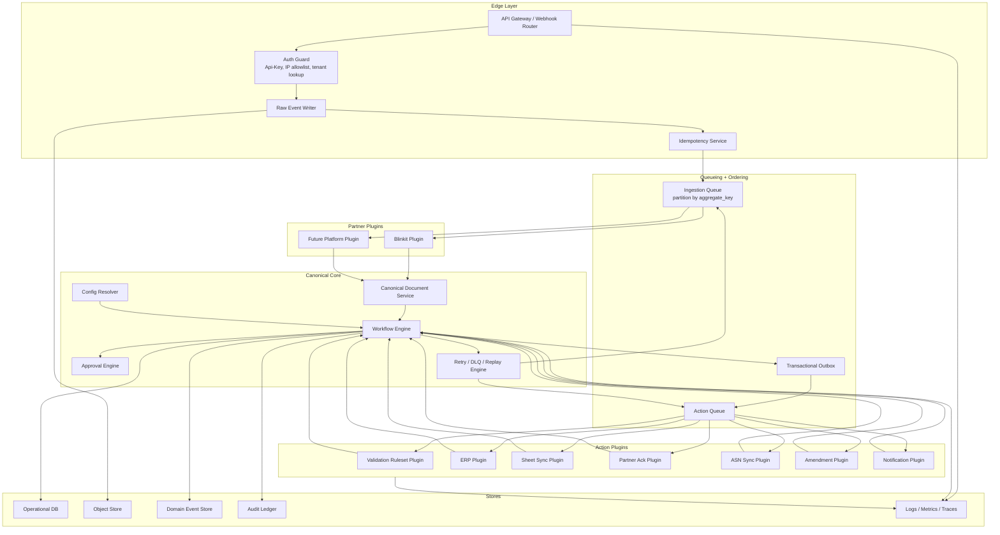
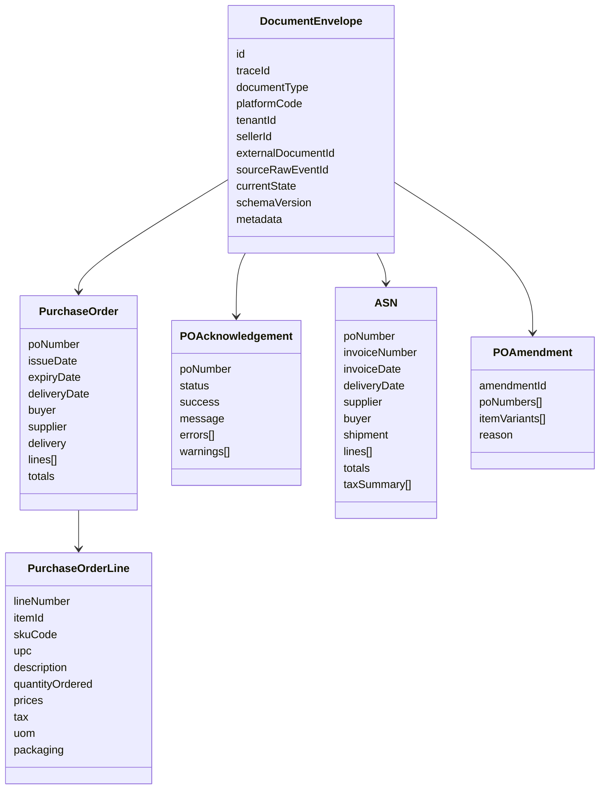
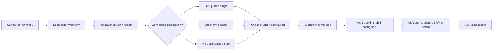
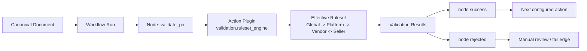
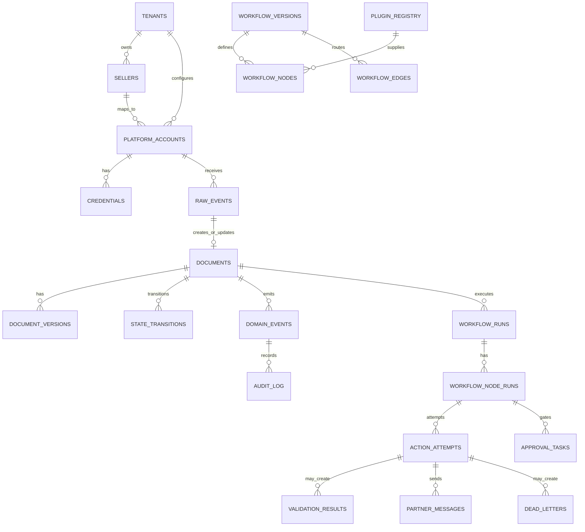

# EDI Integration Platform Architecture

Current design context:

- Platform: Blinkit / partnersbiz first, future platforms later.
- Vendor: our integration customer / supplier organization.
- Seller: supplier/fulfillment entity under vendor.
- First known contracts: PO creation, PO acknowledgement, ASN sync, PO amendment.
- Main goal: modular, pluggable, auditable, scalable EDI workflow platform.

Related local visual boards:

- `.superpowers/brainstorm/86772-1777400267/content/final-complete-architecture.html`
- `.superpowers/brainstorm/86772-1777400267/content/final-design-decisions.html`
- `.superpowers/brainstorm/86772-1777400267/content/flow-first-architecture.html`
- `.superpowers/brainstorm/86772-1777400267/content/scale-concurrency-design.html`

## Core Thought

This system is not a webhook handler. It is a document workflow platform.

```text
Ingress -> Partner Plugin -> Canonical Document -> Workflow DAG -> Action Plugins -> Audit/Trace
```

Stable responsibilities stay in core:

- document state
- idempotency
- workflow-owned validation action nodes
- retries
- audit
- tracing
- replay

Variable responsibilities stay in plugins:

- partner field formats
- partner outbound APIs
- ERP/WMS systems
- notification channels
- sheet exports

## Architecture



## Canonical Meaning

Canonical means one standard internal language.

Blinkit may send:

```json
{
  "po_number": "2264110001440",
  "item_data": [],
  "crates_config": {}
}
```

Another platform may call those:

```json
{
  "order_id": "2264110001440",
  "lines": [],
  "packaging": {}
}
```

Core should not know those differences. Partner plugins convert both into internal `PurchaseOrder`.

```text
Blinkit payload -> Blinkit plugin -> canonical PurchaseOrder
Amazon payload  -> Amazon plugin  -> canonical PurchaseOrder
```

Rule:

- common business fields go into canonical schema
- partner-only fields go into `metadata.{platform}`
- if multiple partners need same concept, promote it into canonical schema

## Canonical Documents

Initial canonical documents:

- `PurchaseOrder`
- `PurchaseOrderAcknowledgement`
- `ASN`
- `POAmendment`



## State Machines

### Raw Webhook Event

```text
received
-> stored
-> dedupe_checked
-> queued
-> processing
-> processed
```

Alternate/failure states:

```text
duplicate
parse_failed
routing_failed
processing_failed
dead_lettered
```

### Document

Documents use generic business states, not ERP-specific stages:

```text
created
ready
in_workflow
waiting
completed
failed
blocked
cancelled
```

### Workflow Run

Workflow runs contain configured steps/actions:

```text
pending
running
waiting
completed
failed
cancelled
```

### Action Attempt

Each plugin execution has its own state:

```text
pending
running
success
partial_success
rejected
retryable_failure
permanent_failure
retry_scheduled
dead_lettered
skipped
```

### ASN

```text
drafted
-> validated
-> processing
-> sent
-> accepted / partially_accepted / rejected
```

### PO Acknowledgement

```text
created
-> queued
-> sent
-> acknowledged
```

### PO Amendment

```text
created
-> validated
-> sent
-> accepted / partially_accepted / rejected
```

PO and ASN lifecycles are linked but separate. PO should not wait for ASN to be considered ack-complete.

## Default Workflow Decision

Default PO flow:



This is not a fixed ERP flow. Seller workflow config decides which actions exist, which are required, and when ASN tracking begins.

## Action Plugin Model

Action plugins are a controlled subscriber model.

Not allowed:

```text
event -> plugin directly mutates document state
```

Allowed:

```text
domain event
-> workflow resolves action bindings
-> creates action_attempt rows
-> worker claims action attempt
-> plugin executes side effect
-> plugin returns result
-> workflow updates state
```

Action plugin interface:

```text
capabilities() -> supported actions/docs
prepare(context) -> outbound request
execute(request) -> external response
interpret(response) -> internal action result
compensate(context) -> optional rollback/follow-up
```

Safe ERP action plugin contract:

```text
Input:
  canonical PurchaseOrder
  tenant/seller config
  action_attempt idempotency key

Output:
  status: success | partial_success | rejected | retryable_failure | permanent_failure
  external_reference: ERP PO id if available
  errors[]
  warnings[]
  raw_request_ref
  raw_response_ref
```

If ERP lacks idempotency, plugin must reconcile by external reference before retry.

## Action Binding Example

```yaml
workflow: purchase_order_v1
nodes:
  - id: validate_po
    type: action
    plugin: validation.ruleset_engine
    required: true
    config:
      ruleset: effective

  - id: punch_po_erp
    type: action
    plugin: erp.generic.create_po
    required: true
    approval_policy: effective
    retry_policy: standard_5x

  - id: send_po_ack
    type: action
    plugin: platform.blinkit.po_ack
    required: true

edges:
  - from: validate_po
    to: punch_po_erp
    on_status: success

  - from: validate_po
    to: manual_review
    on_status: rejected

  - from: punch_po_erp
    to: send_po_ack
    on_status: success
```

## Validation Model

Validation is an action inside workflow, not a layer before workflow.

The validation action plugin is:

```text
validation.ruleset_engine
```

The ruleset engine can run partner contract rules, canonical schema rules, business rules, tenant/seller rules, and action preflight rules. Those are rule categories inside one workflow action node.



Simple declarative rule:

```yaml
rule_id: PO_REQUIRED_FIELDS
scope: canonical.purchase_order
severity: error
checks:
  - field: externalId
    op: required
  - field: seller.externalId
    op: required
  - field: lines
    op: min_length
    value: 1
```

Complex code rule:

```yaml
rule_id: PO_DATE_WINDOW
scope: canonical.purchase_order
severity: error
implementation: rules.po.date_window.v1
params:
  allow_expired_po: false
  max_delivery_days_after_issue: 30
```

Rule engine returns findings. It does not mutate documents. Workflow consumes the validation action result and decides the next edge.

## Workflow, Ruleset, and Approval Configuration

All workflow execution config supports inheritance:

```text
global
-> platform
-> vendor/client
-> seller
```

This applies to:

- workflow assignment
- validation rulesets
- action plugin config
- action approval policy
- retry policy

At runtime the effective config is resolved and frozen on the workflow run.

### Workflow Storage

```text
workflow_templates
workflow_versions
workflow_nodes
workflow_edges
workflow_layouts
workflow_assignments
workflow_runs
workflow_node_runs
approval_tasks
resolved_config_snapshots
```

`workflow_layouts` is UI-only. Backend execution uses nodes and edges.

### Edge Policy

The UI can allow drag/drop, but backend validates allowed edges before publish.

Examples:

```text
validation action -> destination action        allowed
destination action -> PO ack action            allowed
PO ack action -> start ASN tracking            allowed
ASN sync -> PO ack                             rejected
PO ack -> validation                           rejected by default
```

### Action Approval

Every action node has an approval gate. Approval is disabled by default for some actions and enabled by default for others. Seller UI can override only when global/platform/vendor policy permits it.

Example:

```yaml
actions:
  validation.ruleset_engine:
    approval:
      required: false
      seller_can_override: false

  erp.punch_po:
    approval:
      required: true
      seller_can_override: true

  sheet.sync_po:
    approval:
      required: false
      seller_can_override: true
```

## Scale Design

Rule:

```text
Scale globally. Serialize locally per business document.
```

Aggregate key:

```text
aggregate_key = platform_code + ":" + seller_id + ":" + document_type + ":" + external_doc_id
```

Example:

```text
blinkit:seller_67890:purchase_order:2264110001440
```

High-scale flow:

```text
stateless gateway
-> raw_event inbox
-> idempotency key
-> ingestion queue partitioned by aggregate_key
-> document worker with per-aggregate lock
-> workflow state update
-> transactional outbox
-> action workers
```

Use inbox/outbox:

- Inbox: store every inbound event before work.
- Aggregate: one logical document state machine per PO.
- Outbox: create outbound jobs in same DB transaction as state change.

## Data Schema



Core tables:

- `tenants`
- `sellers`
- `platform_accounts`
- `credentials`
- `raw_events`
- `documents`
- `document_versions`
- `state_transitions`
- `domain_events`
- `workflow_templates`
- `workflow_versions`
- `workflow_nodes`
- `workflow_edges`
- `workflow_layouts`
- `workflow_assignments`
- `workflow_runs`
- `workflow_node_runs`
- `approval_tasks`
- `action_attempts`
- `partner_messages`
- `validation_results`
- `dead_letters`
- `audit_log`
- `plugin_registry`
- `idempotency_keys`
- `resolved_config_snapshots`

## Tech Stack Default

- Postgres for operational DB
- S3-compatible object store for raw payloads and large request/response bodies
- RabbitMQ for work queues, retries, and DLQ
- Postgres aggregate locks/versions for same-PO ordering
- DB-backed workflow orchestrator initially
- secrets in vault/secret manager
- OpenTelemetry for trace correlation

## Ops Console Defaults

Allowed:

- search by PO, invoice, trace id
- inspect raw event and canonical document
- inspect state transitions
- retry failed action
- replay raw event
- resend ack/ASN
- restricted state override with mandatory audit reason

Not allowed by default:

- direct mutation of canonical document

Correction should create a new document version or correction event.

## Example Flows

### 1. Happy Path: Blinkit PO

```text
Blinkit sends PO 2264110001440
-> ingress authenticates Api-Key/IP
-> raw_event saved
-> idempotency key created
-> event queued by aggregate_key
-> Blinkit plugin parses payload
-> canonical PurchaseOrder created
-> workflow run created from seller config
-> configured workflow action nodes run
   examples: validation.ruleset_engine, ERP punch OR sheet sync OR both
-> workflow creates PO ack action if configured
-> PO ack sent to partnersbiz
-> workflow completed
-> later invoice/shipment creates ASN
-> ASN sent to partnersbiz
-> ASN accepted
```

### 2. Exact Duplicate PO Webhook

```text
Blinkit retries same PO request
-> ingress saves raw duplicate event
-> idempotency key already exists
-> system returns current/previous result
-> no new document version
-> no duplicate destination action
-> no duplicate PO ack
```

### 3. Same PO With Changed Payload

```text
Same po_number arrives with different body_hash
-> raw_event saved
-> idempotency detects same external id but changed payload
-> document worker locks aggregate_key
-> creates document_version v2 if transition allowed
-> emits purchase_order.updated or amendment-required event
-> workflow decides whether to process, reject, or require manual review
```

### 4. Parse Failure

```text
Bad JSON/XML or invalid partner payload shape
-> raw_event saved
-> Blinkit plugin parse fails
-> raw_event state: parse_failed
-> optional alert action triggered
-> no configured workflow actions run
-> ops can replay after partner resends or mapping fixed
```

### 5. Validation Failure

```text
Payload parses but business rules fail
Example: missing buyer GSTIN or zero line items
-> canonical document created
-> workflow run starts
-> validation.ruleset_engine action returns rejected
-> validation_results stores blocking findings
-> no configured side-effect actions run
-> optional failure notification
-> ops can inspect raw/canonical/rule errors
```

### 6. Warning-Only Validation

```text
Payload has non-blocking issue
Example: optional contact email missing
-> validation.ruleset_engine action returns success with warning findings
-> workflow follows success edge
-> warnings stored and included in trace
-> optional Slack/sheet visibility
```

### 7. Required Action Retryable Failure

```text
required plugin action times out
-> action_attempt status: retryable_failure
-> retry_scheduled or workflow waiting with pending action
-> retry policy schedules next attempt
-> no duplicate side effect because action idempotency key is reused
-> after success, workflow continues to dependent steps
```

### 8. Required Action Permanent Failure

```text
configured destination plugin rejects because mapping missing
-> action returns permanent_failure or rejected
-> action output/error stored
-> workflow creates final PO ack with rejected/partial status if configured
-> workflow failed or waiting for manual review
-> ops can fix mapping and replay action
```

### 9. PO Ack API Failure

```text
required prior actions succeeded
-> PO ack action starts
-> partnersbiz API returns 500 or timeout
-> workflow waits on ack action, ack action retry_scheduled
-> retry uses same idempotency/action_attempt context
-> after max attempts: dead_lettered for ack action
-> ops can resend ack manually
```

### 10. ASN Before PO Ready

```text
ASN event or ASN job becomes due before PO workflow is ready
-> raw_event saved
-> ASN canonical draft created or deferred
-> workflow sees missing dependency: required PO workflow state not reached
-> state: waiting_for_dependency
-> once dependency is satisfied, ASN resumes
```

### 11. ASN Partial Acceptance

```text
ASN sent to partnersbiz
-> response: PARTIALLY_ACCEPTED
-> state: partially_accepted
-> item-level errors stored
-> successful items recorded
-> failed items can trigger amendment, correction, or ops review
```

### 12. Poison Event

```text
Same event fails repeatedly due unknown bug or bad mapping
-> retry limit reached
-> event/action moved to dead_letters
-> core system continues processing other POs
-> ops/dev can inspect trace and replay later
```

## Non-Negotiable Guarantees

- raw event preserved before parsing
- idempotent ingestion
- one state writer per PO aggregate
- append-only domain events
- state transition history
- action attempt audit
- retry and DLQ
- replay support
- plugin isolation
- tenant/seller/platform config separation
