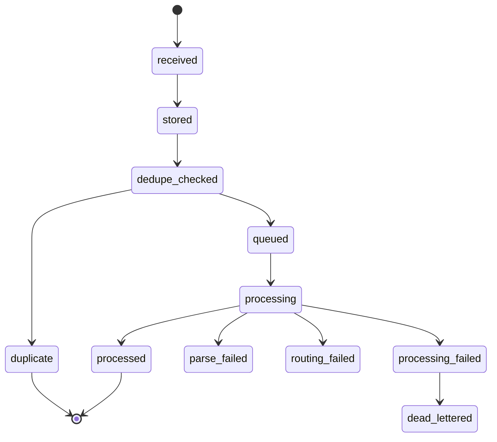
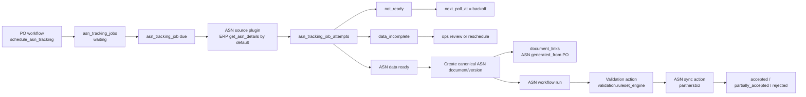

# EDI Integration Platform Technical Design

## 1. Purpose

Build a modular EDI integration platform for platform/vendor/seller flows.

Initial platform: Blinkit via partnersbiz API contracts.

Core business flows:

- Platform sends Purchase Order creation event to us.
- Workflow runs configured action nodes such as validation, ERP punch, sheet sync, acknowledgement, notification, ASN tracking, and amendment.
- If seller workflow chooses ERP, we punch PO into seller ERP.
- If seller workflow chooses sheet sync or another destination, ERP punch is skipped.
- We send PO acknowledgement to platform when configured workflow edges reach that action.
- A short `schedule_asn_tracking` action creates durable ASN tracking state after the PO workflow reaches the configured ASN trigger.
- We poll the configured ASN source plugin from `asn_tracking_jobs`, possibly days later. ERP is the initial/default source plugin.
- We create a separate ASN document and ASN workflow when source data is ready, then send ASN to platform from that ASN workflow.
- User creates PO amendments in our UI.
- We send amendment to platform.

The platform must support:

- multi-platform onboarding
- multi-vendor and multi-seller isolation
- plugin-based partner adapters
- plugin-based actions
- UI-configurable workflow DAGs
- inherited global/platform/vendor/seller config
- idempotency
- per-PO ordered processing
- retries and dead letters
- audit and traceability
- raw payload replay
- validation rules
- long-running ASN polling

## 2. Domain Terms

| Term | Meaning |
|---|---|
| Platform | External marketplace/procurement system. Blinkit/partnersbiz first. |
| Vendor | Our customer/supplier organization using integration platform. |
| Seller | Fulfillment/supplier entity under vendor. |
| Partner Plugin | Platform-specific parser/mapper/outbound payload builder. |
| Action Plugin | Workflow step implementation: validation, enrichment, ERP, sheet sync, partner ack, ASN scheduling/sync, amendment, notification. |
| Canonical Document | Our common internal representation independent of platform field names. |
| Aggregate Key | Human-readable business key used to correlate all work for the same logical document. |
| Aggregate Key Hash | SHA-256 hash of aggregate key used for compact locks, routing, and high-volume indexes. |
| Raw Event | Immutable inbound/outbound payload snapshot. |
| Workflow Node | One executable workflow step. Validation and approval are action nodes. |
| Approval Action | Workflow action plugin that creates/waits for a manual approval decision. It can be placed before an action, after an action, or at an explicit checkpoint edge. |
| ASN Tracking Job | Durable scheduler/readiness row that bridges a completed PO workflow step to later ASN document creation. |
| Journey View | Read model/API that stitches linked documents, jobs, workflow runs, action attempts, and partner messages into one PO-to-ASN graph. |
| Effective Config | Frozen resolved config for one workflow run after inheritance is applied. |

## 3. Design Principles

1. Raw payload is stored before parsing.
2. Same PO is processed one event at a time.
3. Exact duplicates never produce duplicate side effects.
4. Partner-specific code never enters workflow core.
5. Action plugins never mutate document state directly.
6. Workflow engine is the only state owner.
7. State transitions are append-only audited records.
8. Actions are independently retryable.
9. Long waits are persisted as jobs and timers, not sleeping workers or multi-day action attempts.
9. Long-running flows are persisted, not held in memory.
10. Corrections create new versions/events; raw history is never mutated.

## 4. High-Level Architecture

The architecture diagram is rendered in the HTML design site with Cytoscape + Dagre. The source graph is represented below in the same node/edge model used by the site.

```json
{
  "renderer": "cytoscape-dagre",
  "layout": {
    "name": "dagre",
    "rankDir": "TB"
  },
  "nodes": [
    { "id": "api", "label": "Webhook/API Gateway", "layer": "edge" },
    { "id": "auth", "label": "Auth Guard\nApi-Key + IP allowlist", "layer": "edge" },
    { "id": "raw", "label": "Raw Event Writer", "layer": "edge" },
    { "id": "idem", "label": "Idempotency Service", "layer": "core" },
    { "id": "ingest", "label": "RabbitMQ\nedi.ingestion", "layer": "queue" },
    { "id": "partner", "label": "Partner Plugin Runtime", "layer": "plugin" },
    { "id": "blinkit", "label": "Blinkit Partner Plugin", "layer": "plugin" },
    { "id": "canonical", "label": "Canonical Document Service", "layer": "core" },
    { "id": "config", "label": "Config Resolver", "layer": "core" },
    { "id": "workflow", "label": "DB-backed Workflow Engine", "layer": "core" },
    { "id": "approval", "label": "Approval Action Plugin", "layer": "plugin" },
    { "id": "outbox", "label": "Transactional Outbox", "layer": "core" },
    { "id": "actionq", "label": "RabbitMQ\nAction Queues", "layer": "queue" },
    { "id": "validation", "label": "Validation Ruleset Action", "layer": "plugin" },
    { "id": "erp", "label": "ERP Action Plugin", "layer": "plugin" },
    { "id": "sheet", "label": "Sheet Sync Action", "layer": "plugin" },
    { "id": "ack", "label": "Blinkit PO Ack Action", "layer": "plugin" },
    { "id": "asn", "label": "Blinkit ASN Action", "layer": "plugin" },
    { "id": "amendment", "label": "Blinkit Amendment Action", "layer": "plugin" },
    { "id": "notify", "label": "Notification Action", "layer": "plugin" },
    { "id": "retry", "label": "Retry Scheduler", "layer": "core" },
    { "id": "retryq", "label": "RabbitMQ\nRetry Queue", "layer": "queue" },
    { "id": "dlq", "label": "Dead Letter Queues", "layer": "queue" },
    { "id": "poller", "label": "ASN Poller", "layer": "core" },
    { "id": "pg", "label": "Postgres", "layer": "store" },
    { "id": "obj", "label": "Object Store", "layer": "store" },
    { "id": "audit", "label": "Audit Ledger", "layer": "store" },
    { "id": "trace", "label": "Logs / Metrics / Traces", "layer": "store" },
    { "id": "secrets", "label": "Secrets Manager", "layer": "store" }
  ],
  "edges": [
    ["api", "auth"],
    ["auth", "raw"],
    ["raw", "idem"],
    ["raw", "obj"],
    ["idem", "ingest"],
    ["idem", "pg"],
    ["ingest", "partner"],
    ["partner", "blinkit"],
    ["partner", "canonical"],
    ["canonical", "workflow"],
    ["config", "workflow"],
    ["workflow", "outbox"],
    ["outbox", "actionq"],
    ["actionq", "approval"],
    ["actionq", "validation"],
    ["actionq", "erp"],
    ["actionq", "sheet"],
    ["actionq", "ack"],
    ["actionq", "asn"],
    ["actionq", "amendment"],
    ["actionq", "notify"],
    ["approval", "workflow"],
    ["validation", "workflow"],
    ["erp", "workflow"],
    ["sheet", "workflow"],
    ["ack", "workflow"],
    ["asn", "workflow"],
    ["amendment", "workflow"],
    ["notify", "workflow"],
    ["retry", "retryq"],
    ["retryq", "actionq"],
    ["workflow", "poller"],
    ["poller", "erp"],
    ["workflow", "pg"],
    ["workflow", "audit"],
    ["workflow", "trace"],
    ["actionq", "dlq"],
    ["approval", "secrets"],
    ["validation", "secrets"],
    ["erp", "secrets"],
    ["sheet", "secrets"],
    ["ack", "secrets"],
    ["asn", "secrets"],
    ["amendment", "secrets"],
    ["notify", "secrets"],
    ["approval", "obj"],
    ["validation", "obj"],
    ["erp", "obj"],
    ["sheet", "obj"],
    ["ack", "obj"],
    ["asn", "obj"],
    ["amendment", "obj"],
    ["notify", "obj"]
  ]
}
```

## 5. Technology Choices

| Concern | Decision | Reason |
|---|---|---|
| Operational state | Postgres | Transactions, locks, JSONB, constraints, audit-friendly. |
| Raw payload storage | S3-compatible object store | Preserve large immutable payloads. |
| Messaging | RabbitMQ | Good fit for work queues, retries, DLQ, routing by action type. |
| Ordering | Postgres aggregate lock/version, optional RabbitMQ consistent hash | RabbitMQ alone is not enough; DB lock is mandatory. |
| Workflow | DB-backed workflow engine | Document state machine is core. Avoid external workflow lock-in initially. |
| Scaling | Kubernetes Deployments + KEDA ScaledJobs/ScaledObjects | Scale workers/pollers based on queue depth/schedule. |
| Secrets | Vault/Secrets Manager | API keys and ERP credentials stay out of DB. |
| Observability | OpenTelemetry + structured logs + metrics | Trace async flow across services. |

## 6. Services

### 6.1 Ingress API Service

Responsibilities:

- expose platform webhooks
- authenticate `Api-Key`
- validate IP allowlist
- detect content type JSON/XML
- assign `trace_id`
- store raw event in object store
- insert `raw_events`
- compute payload hash and non-unique dedupe key
- enqueue ingestion job after append-only raw storage

It does not:

- run business validation
- call ERP
- call partnersbiz outbound APIs

### 6.2 Document Worker

Responsibilities:

- consume ingestion jobs
- lock aggregate in Postgres
- load partner plugin
- parse partner payload
- map to canonical document
- create document version
- resolve effective published workflow
- create workflow run
- hand off execution to workflow engine

### 6.3 Outbox Dispatcher

Responsibilities:

- read pending outbox rows
- publish RabbitMQ action jobs
- mark outbox rows as dispatched
- retry safe publish failures

### 6.4 Action Workers

Responsibilities:

- claim workflow node/action work
- claim action attempts
- execute configured action plugin
- store request/response payloads
- return normalized action result
- let workflow update document state

Validation workers use the same action worker model. `validation.ruleset_engine` is an action plugin that runs inside workflow, stores `validation_results`, and returns `success`, `rejected`, `retryable_failure`, or `permanent_failure`.

Approval workers also use the same action worker model. `approval.manual_decision` is an action plugin that creates or waits for `approval_tasks`, stores the approver decision, and returns `approved`, `rejected`, `expired`, or `cancelled`.

### 6.5 ASN Poller

Responsibilities:

- find due `asn_tracking_jobs`
- call configured ASN source plugin
- record every poll in `asn_tracking_job_attempts`
- create canonical ASN document/version when source data is ready
- link ASN document to PO with `document_links`
- create separate ASN workflow run when source data is ready
- reschedule when source plugin says `not_ready`
- route incomplete data to review or reschedule based on policy

It can be implemented as KEDA Cron/ScaledJob or long-running scheduled worker.

The poller is not a replacement for workflow actions. The PO workflow contains a short `schedule_asn_tracking` action that creates the tracking job and completes. The long wait belongs to `asn_tracking_jobs`; ASN validation and ASN sync belong to the later ASN workflow.

### 6.6 Ops API/UI

Responsibilities:

- search by PO/invoice/trace id
- inspect raw/canonical payloads
- view state transitions
- retry action
- replay raw event
- trigger ASN poll now
- resend ack/ASN
- create amendment
- restricted state override with audit reason

### 6.7 Config/Admin API

Responsibilities:

- create/edit workflow drafts
- validate workflow graph before publish
- publish immutable workflow versions
- assign workflows at global/platform/vendor/seller scope
- create/edit ruleset drafts
- publish ruleset versions
- configure action plugin settings
- configure approval policy overrides
- configure retry policy overrides
- expose effective config preview before publish

This API is design-time only. It must not mutate runtime workflow runs.

### 6.8 Runtime API Surface

Platform webhook APIs:

```text
POST /webhooks/{platform}/purchase-orders
POST /webhooks/{platform}/asn-events optional future
```

Ops APIs:

```text
GET  /ops/documents?platform=&seller=&externalDocumentId=
GET  /ops/documents/{documentId}
GET  /ops/documents/{documentId}/versions
GET  /ops/workflow-runs/{workflowRunId}
GET  /ops/traces/{traceId}
POST /ops/action-attempts/{actionAttemptId}/retry
POST /ops/raw-events/{rawEventId}/replay
POST /ops/asn-tracking-jobs/{asnTrackingJobId}/poll-now
POST /ops/approvals/{approvalTaskId}/approve
POST /ops/approvals/{approvalTaskId}/reject
POST /ops/amendments
```

Config APIs:

```text
POST /config/workflow-templates
POST /config/workflow-versions/{versionId}/validate
POST /config/workflow-versions/{versionId}/publish
POST /config/workflow-assignments
POST /config/ruleset-versions
POST /config/ruleset-versions/{versionId}/publish
POST /config/action-plugin-configs
POST /config/approval-policies
POST /config/retry-policies
GET  /config/effective?platform=&vendor=&seller=&documentType=
```

### 6.9 Critical Worker Algorithms

Ingress API algorithm:

```text
1. authenticate Api-Key and IP allowlist
2. resolve platform_account, vendor, seller
3. assign trace_id
4. persist raw payload to object store
5. insert raw_events row with status=stored
6. compute payload_hash and non-unique dedupe_key
7. enqueue edi.ingestion through outbox or direct publish with DB record
8. return 202 accepted
```

Document worker algorithm:

```text
1. consume ingestion message
2. lock aggregate_key row or document identity
3. load raw_event and latest document/version
4. run partner parser/mapper only
5. if parse fails:
     raw_event=parse_failed, dead letter/replay metadata, stop
6. compare payload hash with latest version
7. if exact duplicate:
     set raw_event.duplicate_of_raw_event_id, raw_event=duplicate, stop
8. if changed same PO:
     apply same-PO policy based on existing workflow/action position
9. create document and document_version
10. resolve effective published workflow/config
11. insert resolved_config_snapshot
12. create workflow_run and first workflow_node_runs
13. append state_transitions
14. write outbox rows for ready nodes
```

Workflow engine algorithm:

```text
1. receive node result from action worker
2. lock workflow_run
3. update workflow_node_run status
4. append state_transitions
5. evaluate outgoing edges by node status and condition_expr
6. create next workflow_node_runs when dependencies are satisfied
7. create action_attempts as needed, including approval action attempts
8. write outbox rows transactionally
9. update workflow_run/document state
10. complete/fail/block workflow if terminal conditions are met
```

Action worker algorithm:

```text
1. consume action message
2. lock workflow_node_run and action_attempt
3. verify node is claimable and not stale
4. build plugin context from frozen config snapshot
5. call plugin.prepare
6. store outbound request_ref if plugin calls an external system
7. call plugin.execute
8. store raw response_ref if plugin receives external response
9. call plugin.interpret
10. persist normalized result
11. notify workflow engine

Approval is not hidden inside this worker algorithm. If approval is required, workflow contains an explicit approval action node such as `approval.manual_decision`. That approval action creates or waits on `approval_tasks`, then returns `approved`, `rejected`, `expired`, or `cancelled`.
```

## 7. Canonical Documents

### 7.1 Document Envelope

Common wrapper around all documents:

```json
{
  "id": "uuid",
  "traceId": "uuid",
  "documentType": "purchase_order",
  "platformCode": "blinkit",
  "vendorId": "vendor_acme",
  "sellerId": "uuid",
  "externalDocumentId": "2264110001440",
  "sourceRawEventId": "uuid",
  "schemaVersion": "purchase_order.v1",
  "currentState": "in_workflow",
  "metadata": {
    "blinkit": {}
  }
}
```

### 7.2 PurchaseOrder

Core fields:

- `poNumber`
- `issueDate`
- `expiryDate`
- `deliveryDate`
- `buyer`
- `supplier`
- `delivery`
- `lines[]`
- `totals`
- `metadata`

Line fields:

- `lineNumber`
- `itemId`
- `skuCode`
- `upc`
- `description`
- `quantityOrdered`
- `prices`
- `tax`
- `uom`
- `packaging`

### 7.3 ASN

Core fields are based on Blinkit ASN API payload:

- `poNumber`
- `invoiceNumber`
- `invoiceDate`
- `deliveryDate`
- `taxDistribution[]`
- `basicPrice`
- `landingPrice`
- `boxCount`
- `quantity`
- `caseConfig`
- `itemCount`
- `poStatus`
- `supplierDetails`
- `buyerDetails`
- `shipmentDetails`
- `items[]`

Item fields:

- `itemId`
- `skuCode`
- `batchNumber`
- `skuDescription`
- `upc`
- `quantity`
- `mrp`
- `hsnCode`
- `taxDistribution`
- `unitDiscountAmount`
- `unitDiscountPercentage`
- `unitBasicPrice`
- `unitLandingPrice`
- `expiryDate`
- `mfgDate`
- `shelfLife`
- `uom`
- `noOfPackages`
- `codeCategory`
- `codes[]`
- `caseConfiguration[]`

### 7.4 POAcknowledgement

Fields:

- `poNumber`
- `status`: `processing | accepted | partially_accepted | rejected`
- `success`
- `message`
- `errors[]`
- `warnings[]`

### 7.5 POAmendment

Fields:

- `amendmentId`
- `poNumbers[]`
- `itemVariants[]`
- `reason`
- `createdBy`

Variant:

- `itemId`
- `upc`
- `mrp`
- `uom`
- `poNumbers[]`

## 8. Database Schema

Core tables:

```text
brands
vendors
sellers
platform_accounts
credentials
raw_events
idempotency_keys
documents
document_versions
document_links
state_transitions
domain_events
validation_results
workflow_templates
workflow_versions
workflow_nodes
workflow_edges
workflow_layouts
workflow_assignments
workflow_runs
workflow_node_runs
approval_tasks
rule_definitions
ruleset_versions
ruleset_rules
ruleset_assignments
action_plugin_configs
approval_policy_versions
retry_policy_versions
resolved_config_snapshots
outbox
action_attempts
partner_messages
asn_tracking_jobs
asn_tracking_job_attempts
dead_letters
audit_log
plugin_registry
```

### 8.1 Important Constraints

```sql
-- One business document identity.
unique(platform_code, seller_id, doc_type, external_doc_id)

-- Immutable version history and exact duplicate protection.
unique(document_id, version)
unique(document_id, payload_hash)

-- Action retry identity.
unique(action_attempt_id, attempt_no)

-- Workflow execution identity.
unique(document_version_id, workflow_version_id)
unique(workflow_run_id, node_key)

-- Queue and partner side-effect identity.
unique(outbox.source_type, outbox.source_id, outbox.event_type)
unique(partner_messages.platform_code, partner_messages.endpoint, partner_messages.idempotency_key)

-- ASN readiness identity.
unique(asn_tracking_jobs.po_document_id, asn_tracking_jobs.po_document_version_id, asn_tracking_jobs.source_plugin_id)
unique(asn_tracking_job_attempts.asn_tracking_job_id, asn_tracking_job_attempts.attempt_no)
```

### 8.2 Aggregate Key

The aggregate key concept is standard in event-driven systems, but the exact string format is our convention. Similar names in other systems are aggregate id, business key, correlation key, message key, or partition key.

```text
aggregate_key = platform_code + ":" + seller_id + ":" + doc_type + ":" + external_doc_id
aggregate_key_hash = sha256(aggregate_key)
```

Example:

```text
aggregate_key      = blinkit:seller_67890:purchase_order:2264110001440
aggregate_key_hash = sha256:7b8f4e...
```

Use both values:

| Field | Use |
|---|---|
| `aggregate_key` | Ops search, logs, audit, readable trace/debug context. |
| `aggregate_key_hash` | Advisory locks, compact queue routing/partitioning, high-cardinality indexes. |

Do not use only Base64. Base64 is only encoding and makes operations harder. Do not use only hash because async debugging becomes painful. Keep readable text and hash together.

Same aggregate key means same ordered processing lane. Same aggregate key hash means same compact lock/routing target.

### 8.3 Blinkit Identity Mapping

Blinkit does not provide our internal `vendor_id`, `seller_id`, or `brand_id`.

Blinkit PO creation provides external identifiers:

```text
tenant = HYPERPURE
details.supplier_details.id = 67890
details.supplier_details.gstin = 27ABCDE1234F1Z5
details.outlet_id = 12543
details.item_data[].item_id = 10016623
details.item_data[].sku_code / upc
```

Ingestion resolves these once:

```text
tenant + supplier_details.id + optional GSTIN/outlet
-> platform_accounts
-> vendor_id + seller_id

item_id / sku_code / upc
-> seller_item_mappings
-> brand_id
```

Minimal management rule:

- `platform_accounts` owns external account/supplier identity mapping.
- `seller_item_mappings` owns external item-to-internal-brand mapping.
- `raw_events`, `documents`, workflow runs, ASN jobs, and audit rows store resolved `vendor_id` and `seller_id`.
- `brand_id` is internal enrichment for product ownership/reporting/validation, not a Blinkit field.

If a Blinkit PO arrives with unknown supplier mapping, store the raw event and mark it `needs_mapping`; do not run external side effects. If an item mapping is unknown, create a pending item mapping and block only the workflow node that needs missing ASN fields.

### 8.4 Detailed Operational Schema

This is the implementation-level table shape. Exact SQL types can be adjusted, but these columns are the required persistence contracts.

#### raw_events

```text
id
trace_id
platform_code
vendor_id
seller_id
event_type
external_document_id
aggregate_key
aggregate_key_hash
dedupe_key
duplicate_of_raw_event_id
payload_hash
headers_json
content_type
raw_payload_ref
status
received_at
processed_at
error_code
error_message
created_at
updated_at
```

Purpose:

- immutable inbound/outbound event envelope
- stores every webhook, including duplicates and failed parses
- first traceability anchor for a PO journey

Indexes:

```sql
index(dedupe_key)
index(platform_code, seller_id, external_document_id, payload_hash)
index(aggregate_key_hash, received_at)
index(aggregate_key)
index(trace_id)
index(platform_code, seller_id, external_document_id)
index(status, received_at)
```

#### documents

```text
id
document_type
platform_code
vendor_id
seller_id
external_document_id
aggregate_key
aggregate_key_hash
current_version_id
current_state
created_from_raw_event_id
created_at
updated_at
```

Purpose:

- canonical business document identity
- does not contain plugin-specific lifecycle such as ERP synced or ack sent

#### document_versions

```text
id
document_id
version
source_raw_event_id
payload_hash
canonical_json
partner_metadata_json
change_summary_json
created_by_type
created_by_id
created_at
```

Purpose:

- immutable version history
- same PO with changed payload creates a new version when allowed
- old versions remain available for audit and replay

#### workflow_templates

```text
id
name
document_type
platform_code
scope_type
scope_id
status
created_by
created_at
updated_at
```

Purpose:

- logical workflow family, for example `Blinkit Purchase Order Default`

#### workflow_versions

```text
id
workflow_template_id
version
status = draft / published / archived
definition_hash
published_at
published_by
created_at
updated_at
```

Rule:

- published versions are immutable
- UI edits create a new draft version

#### workflow_nodes

```text
id
workflow_version_id
node_key
node_type
plugin_id
required
config_json
retry_policy_ref
timeout_seconds
created_at
```

Examples:

```text
validate_po -> action -> validation.ruleset_engine
approve_before_erp -> action -> approval.manual_decision
erp_punch -> action -> erp.punch_po
approve_after_erp -> action -> approval.manual_decision
sheet_sync -> action -> sheet.sync_po
po_ack -> action -> blinkit.po_ack
```

#### workflow_edges

```text
id
workflow_version_id
from_node_key
to_node_key
on_status
condition_expr
created_at
```

Examples:

```text
validate_po success -> erp_punch
validate_po rejected -> manual_review
erp_punch success -> blinkit_po_ack
```

#### workflow_layouts

```text
id
workflow_version_id
node_key
x
y
width
height
ui_metadata_json
updated_at
```

Purpose:

- UI-only drag/drop layout
- not used for backend execution

#### workflow_assignments

```text
id
scope_type = global / platform / vendor / seller
scope_id
platform_code
document_type
workflow_version_id
priority
effective_from
effective_until
created_at
```

Resolution:

```text
seller > vendor > platform > global
```

#### workflow_runs

```text
id
document_id
document_version_id
workflow_version_id
resolved_config_snapshot_id
status
started_at
completed_at
created_at
updated_at
```

#### workflow_node_runs

```text
id
workflow_run_id
node_key
node_type
plugin_id
status
input_snapshot_json
output_json
started_at
completed_at
updated_at
```

#### approval_tasks

```text
id
workflow_run_id
approval_workflow_node_run_id
target_workflow_node_run_id nullable
target_plugin_id nullable
approval_phase = pre_action / post_action / checkpoint / publish
status = pending / approved / rejected / expired / cancelled
requested_role
requested_user_id
approved_by
decision_reason
decision_payload_json
created_at
decided_at
expires_at
```

#### action_attempts

```text
id
workflow_node_run_id
plugin_id
attempt_no
status
idempotency_key
request_ref
response_ref
error_code
error_message
next_retry_at
started_at
completed_at
created_at
```

#### validation_results

```text
id
workflow_run_id
workflow_node_run_id
action_attempt_id
ruleset_version_id
status
findings_json
created_at
```

Validation results are produced only by the validation action plugin. They are not a separate pre-workflow state source.

#### rule_definitions

```text
id
rule_key
rule_type
description
input_schema_json
default_config_json
created_at
updated_at
```

#### ruleset_versions

```text
id
name
scope_type
scope_id
document_type
version
status
published_at
published_by
created_at
```

#### ruleset_rules

```text
id
ruleset_version_id
rule_key
enabled
severity
blocking
locked
seller_can_disable
seller_can_override_config
allowed_override_fields_json
config_json
created_at
```

#### ruleset_assignments

```text
id
scope_type
scope_id
platform_code
document_type
ruleset_version_id
priority
effective_from
effective_until
```

#### action_plugin_configs

```text
id
plugin_id
scope_type
scope_id
version
status
config_json
secret_refs_json
published_at
created_at
```

#### approval_policy_versions

```text
id
plugin_id
scope_type
scope_id
version
required
seller_can_override
default_phase = pre_action / post_action / checkpoint / publish
allowed_phases_json
allowed_override_fields_json
approver_role
timeout_seconds
escalation_policy_json
status
published_at
```

#### retry_policy_versions

```text
id
policy_key
scope_type
scope_id
version
max_attempts
initial_delay_seconds
backoff_multiplier
max_delay_seconds
retryable_error_codes_json
status
published_at
```

#### resolved_config_snapshots

```text
id
document_id
document_version_id
workflow_version_id
ruleset_version_id
resolved_from_json
action_configs_json
approval_policies_json
retry_policies_json
plugin_versions_json
created_at
```

Purpose:

- freezes all inherited global/platform/vendor/seller config used by a workflow run
- makes historical execution reproducible and auditable

#### outbox

```text
id
aggregate_key
aggregate_key_hash
event_type
destination_queue
payload_json
status = pending / dispatched / failed
available_at
dispatched_at
created_at
```

#### asn_tracking_jobs

```text
id
po_document_id
po_document_version_id
seller_id
source_plugin_id
status = waiting / polling / not_ready / data_incomplete / ready / created_asn / cancelled / expired / failed
next_poll_at
max_poll_until
attempt_count
created_asn_document_id nullable
created_asn_document_version_id nullable
last_error_code
last_error_message
created_at
updated_at
```

Purpose:

- durable timer/readiness state for ASN creation
- created by short `schedule_asn_tracking` workflow action
- not a business document and not a long-running action attempt
- allows polling to survive deploys, restarts, and multi-day waits

#### asn_tracking_job_attempts

```text
id
asn_tracking_job_id
attempt_no
source_plugin_id
status = not_ready / data_incomplete / ready / retryable_failure / permanent_failure
request_ref
response_ref
error_code
error_message
started_at
completed_at
created_at
```

Purpose:

- append-only history of every ASN source poll
- stores object refs for ERP/file/API request and response payloads
- separates readiness polling from outbound ASN sync attempts

#### partner_messages

```text
id
action_attempt_id
platform_code
direction = inbound / outbound
endpoint
request_ref
response_ref
status_code
created_at
```

#### state_transitions

```text
id
entity_type
entity_id
from_state
to_state
reason
actor_type
actor_id
trace_id
metadata_json
created_at
```

Append-only. No update/delete in normal operation.

## 9. State Management

State is split across four independent layers. This is intentional.

1. `raw_events` tracks the platform webhook/event lifecycle.
2. `documents` tracks canonical business document lifecycle.
3. `workflow_runs` tracks configurable workflow execution.
4. `action_attempts` tracks each plugin execution.

PO state must not contain ERP-specific stages. ERP punch, sheet sync, ASN creation, notifications, and validation are workflow action nodes/action attempts. A seller may choose ERP punch, sheet sync, both, or neither.

### 9.1 Raw Webhook/Event States

Every webhook from Blinkit creates a `raw_events` row, including duplicates.



`raw_event.processed` means the platform event was accepted into our system. It does not mean the PO business workflow is finished.

### 9.2 Document States

Documents stay generic and business-level.

```text
created
ready
in_workflow
waiting
completed
failed
cancelled
blocked
```

Example: a `PurchaseOrder` can be `in_workflow` while its configured workflow runs ERP punch, sheet sync, PO ack, notifications, or ASN scheduling actions.

### 9.3 Workflow Run States

Each document gets one or more workflow runs.

```text
pending
running
waiting
completed
failed
cancelled
```

Workflow steps are configured per vendor/seller/platform. Example seller A may run ERP punch; seller B may run sheet sync.

Workflow definitions are versioned DAGs. A running workflow always references a published immutable `workflow_version_id` and a frozen `resolved_config_snapshot_id`.

### 9.3.1 Workflow Node Run States

Each workflow node execution is tracked separately from the overall workflow.

```text
pending
ready
waiting
running
success
rejected
retry_scheduled
failed
skipped
cancelled
```

### 9.4 Action Attempt States

Each plugin execution is tracked independently.

```text
pending
waiting
running
success
partial_success
approved
rejected
expired
retryable_failure
permanent_failure
retry_scheduled
dead_lettered
cancelled
skipped
```

### 9.5 ASN Tracking Job / ASN Document States

```text
waiting_for_asn
polling_source_plugin
asn_data_incomplete
asn_ready
accepted
partially_accepted
rejected
dead_lettered
```

ASN validation and ASN send are not separate ASN document states. They are workflow nodes/action attempts inside the ASN workflow:

```text
asn_ready
-> ASN workflow run
   -> validation.ruleset_engine action
   -> blinkit.asn_sync action
-> accepted / partially_accepted / rejected / dead_lettered
```

The default ASN source is ERP `get_asn_details`, but the architecture allows another ASN creation plugin later.

### 9.6 State Ownership

Only workflow engine can update `documents.current_state`.

Plugins return results only.

## 10. Ingestion and Idempotency

### 10.1 Exact Duplicate

Compare:

- `business_key`
- `payload_hash`

```text
business_key same + payload_hash same = exact duplicate
```

System behavior:

- raw event still stored
- duplicate raw event links to original raw event
- no new document version
- no action side effects

### 10.2 Same PO, Changed Payload

```text
business_key same + payload_hash different = changed same-PO event
```

Policy:

| Current Workflow/Action Position | Behavior |
|---|---|
| No required side-effect action has started | Create new document version, revalidate, re-run workflow. |
| Required side-effect action is running or completed | Pause workflow and create manual review. |
| Workflow completed | Do not overwrite. Create `changed_same_po_event` and manual review. |
| Workflow failed/dead-lettered | Allow ops replay/new version only. |

Material changes:

- item list
- quantities
- prices
- tax
- delivery date
- buyer/supplier GSTIN
- expiry date

Non-material changes:

- optional contact formatting
- optional custom attributes
- whitespace/format-only changes

Non-material changes may be stored as new version without re-running actions, if rules allow.

### 10.3 Layered Idempotency Model

Idempotency is layered. One table must not own every duplicate rule.

```text
raw_events
  stores every webhook/replay, including duplicates
  uses non-unique dedupe_key + duplicate_of_raw_event_id

documents
  owns logical business document identity
  unique(platform_code, seller_id, document_type, external_document_id)

document_versions
  owns exact payload/version identity
  unique(document_id, payload_hash)

workflow_runs / workflow_node_runs
  own execution identity for one document version and node
  unique(document_version_id, workflow_version_id)
  unique(workflow_run_id, node_key)

idempotency_keys
  owns execution claim/reservation only
  unique(scope, key)

partner_messages
  owns external request side-effect evidence
  unique(platform_code, endpoint, idempotency_key)

outbox
  owns async message publish identity
  unique(source_type, source_id, event_type)
```

#### Example: Duplicate Blinkit PO Webhook

First webhook:

```text
raw_evt_001 stored with dedupe_key=blinkit:purchase_order:PO-1001:h1
documents insert doc_po_001
document_versions insert doc_ver_po_001 with payload_hash=h1
workflow_run created
```

Second identical webhook:

```text
raw_evt_002 stored with same dedupe_key
document worker finds document_versions unique(document_id, payload_hash=h1)
raw_evt_002.duplicate_of_raw_event_id = raw_evt_001
raw_evt_002.status = duplicate
no workflow/action/partner side effect is created
```

Changed same PO:

```text
raw_evt_003 stored with dedupe_key=blinkit:purchase_order:PO-1001:h2
documents unique key resolves existing doc_po_001
document_versions payload_hash h2 is new
same-PO change policy decides whether to create v2 workflow or manual review
```

#### Example: Blinkit PO ACK Retry

Before calling Blinkit ACK, action worker claims the side effect:

```text
scope = external_action
key = blinkit.po_ack:doc_po_001:doc_ver_po_001
status = processing
first_seen_ref_type = action_attempt
first_seen_ref_id = act_ack_1
```

`unique(scope, key)` allows only one worker to own that ACK. On success:

```text
partner_messages insert:
  platform_code = blinkit
  endpoint = /po/acknowledgement
  idempotency_key = blinkit.po_ack:doc_po_001:doc_ver_po_001
  status_code = 200

idempotency_keys update:
  status = completed
  result_ref_type = partner_message
  result_ref_id = msg_blinkit_ack
```

If a retry happens after success, the worker sees `status=completed` and returns the existing result without calling Blinkit again.

If the worker crashes before the external call, stale `processing` can be reclaimed by retry policy. If the worker times out after sending the external request, retry must use the same idempotency key. If the partner does not support external idempotency or lookup/reconciliation, automatic replay is blocked and routed to manual review.

## 11. Workflow Configuration, Rules, and Approval

### 11.1 Workflow Is The Orchestrator

Validation is not a separate lifecycle before workflow.

Correct flow:

```text
raw event
-> canonical document
-> workflow run
   -> validation action node
   -> destination action node
   -> ack/action nodes
   -> ASN/amendment/notification nodes
```

Incorrect flow:

```text
canonical document -> validation layer -> workflow
```

Every meaningful step after canonical document creation is a workflow node.

### 11.1.1 PO Workflow and ASN Workflow Boundaries

PO and ASN are separate executable workflows because they operate on separate documents and different clocks. The PO workflow is responsible for receiving, validating, syncing, acknowledging, and scheduling ASN tracking. The ASN workflow starts only after the ASN source data is ready and an `AdvanceShipmentNotice` document/version exists.

Recommended PO workflow:

```text
workflow_template: Blinkit Purchase Order Default
document_type: purchase_order

validate_po
-> erp_punch and/or sheet_sync
-> blinkit_po_ack
-> schedule_asn_tracking
-> po_workflow_complete
```

Recommended ASN workflow:

```text
workflow_template: Blinkit ASN Default
document_type: advance_shipment_notice

validate_asn
-> optional_asn_approval
-> blinkit_asn_sync
-> asn_workflow_complete
```

The bridge is not a long-running workflow node:

```text
PO workflow node: schedule_asn_tracking
-> creates asn_tracking_jobs row
-> node status = success
-> PO workflow can complete

ASN tracking worker:
-> polls source plugin when next_poll_at is due
-> writes asn_tracking_job_attempts
-> creates ASN document/version when ready
-> creates document_links row: ASN generated_from PO
-> starts ASN workflow
```

Workflow graph rules:

| Rule | Reason |
|---|---|
| `blinkit_asn_sync` cannot be in PO workflow. | It needs an ASN document/version as input. |
| `schedule_asn_tracking` can be in PO workflow. | It is a bounded action that creates durable tracking state. |
| `asn_tracking_jobs` is not a workflow node. | It is scheduler/readiness state for multi-day waiting. |
| ASN workflow must start from an ASN document. | Keeps validation, retries, and partner sync scoped to ASN lifecycle. |
| Journey UI can show PO + ASN as one graph. | Read model can stitch linked workflows without mixing execution ownership. |

### 11.2 Workflow Definition Storage

Use executable graph tables:

```text
workflow_templates
workflow_versions
workflow_nodes
workflow_edges
workflow_layouts
workflow_assignments
```

Published `workflow_versions` are immutable. UI drag/drop edits create a new draft version, then publish a new version after validation.

`workflow_layouts` stores only node coordinates and visual metadata. Backend execution uses `workflow_nodes` and `workflow_edges`.

### 11.3 Workflow Inheritance

Workflow assignment resolution:

```text
seller workflow
else vendor workflow
else platform workflow
else global workflow
```

The resolved workflow version is frozen on `workflow_runs.workflow_version_id`.

### 11.4 Edge Policy

The UI can support drag/drop, but backend must validate allowed edges before publish.

Example allowed edges:

```text
validation action -> destination action
destination action -> PO ack action
PO ack action -> start ASN tracking action
manual review -> destination action
```

Example rejected edges:

```text
ASN sync -> PO ack
PO ack -> validation
amendment action -> silent original PO mutation
```

Node types and plugins declare edge constraints. For example, `blinkit.po_ack` can require that `validation.ruleset_engine` appears before it in the DAG.

### 11.5 Validation As Action

Validation is implemented by an action plugin:

```text
validation.ruleset_engine
```

Example workflow node:

```json
{
  "nodeKey": "validate_po",
  "nodeType": "action",
  "pluginId": "validation.ruleset_engine",
  "required": true,
  "config": {
    "rulesetRef": "effective",
    "documentType": "purchase_order",
    "failOnSeverity": "error"
  },
  "approvalPolicyRef": "validation_default",
  "retryPolicyRef": "no_retry"
}
```

Validation node result drives workflow edges:

```yaml
edges:
  - from: validate_po
    to: erp_punch
    on_status: success

  - from: validate_po
    to: manual_review
    on_status: rejected
```

### 11.6 Ruleset Inheritance and Custom Rules

Ruleset config is inherited and resolved for the validation action plugin. Validation is not a hidden stage before workflow. It is a workflow action node, usually `validation.ruleset_engine`, and the effective ruleset is the config consumed by that node.

Inheritance order:

```text
global
-> platform
-> vendor/client
-> seller
```

Recommended ownership model:

| Level | Purpose | Who Configures | Examples |
|---|---|---|---|
| global | Non-negotiable platform safety and canonical contract rules | system admin | PO number required, line items required, duplicate line key rule |
| platform | Partner-specific API/contract rules | platform admin | Blinkit facility required, Blinkit date format constraints |
| vendor/client | Business-specific rules for a customer organization | vendor admin | SKU must exist in vendor catalog, GST/tax mapping required |
| seller | Seller-specific operating rules and allowed overrides | seller admin | minimum order value warning, delivery window override |

There are two separate operations:

1. Create a reusable `rule_definition`.
2. Add/configure that rule inside a `ruleset_version`.

This distinction matters because a rule definition is the catalog entry, while a ruleset version decides whether that rule is enabled, blocking, locked, or configured differently for a specific scope.

Rule definition example:

```json
{
  "ruleKey": "po_required_fields",
  "ruleType": "field_check",
  "documentType": "purchase_order",
  "description": "PO must contain mandatory canonical fields",
  "inputSchema": {
    "required": ["checks"]
  },
  "defaultConfig": {
    "checks": [
      { "field": "externalId", "op": "required" },
      { "field": "seller.externalId", "op": "required" },
      { "field": "lines", "op": "min_length", "value": 1 }
    ]
  }
}
```

PO validation is scoped at two levels:

- `purchase_order`: header or aggregate checks such as PO number, seller, buyer GSTIN, facility, delivery window, and `lines` minimum length.
- `purchase_order.line`: line-item checks such as item id/SKU presence, UPC format, duplicate line key, positive quantity, unit price bounds, seller item mapping, HSN/tax mapping, and case/UOM compatibility.

Both scopes run inside the same `validate_po` action attempt. The rule engine returns one result for the node, but each finding must carry enough location data for ops review, partial correction, and audit.

Example line-level finding:

```json
{
  "scope": "purchase_order.line",
  "path": "lines[3].skuCode",
  "lineId": "PO-1001:BLK-ITEM-7788",
  "externalLineRef": {
    "platformItemId": "BLK-ITEM-7788",
    "skuCode": "1000007788",
    "upc": "8901234567890"
  },
  "ruleKey": "sku_mapping_required",
  "severity": "error",
  "blocking": true,
  "message": "Blinkit item is not mapped to a seller SKU"
}
```

Ruleset rule example:

```json
{
  "rulesetVersionId": "blinkit_po_global_v3",
  "ruleKey": "po_required_fields",
  "enabled": true,
  "severity": "error",
  "blocking": true,
  "locked": true,
  "sellerCanDisable": false,
  "sellerCanOverrideConfig": false,
  "config": {
    "checks": [
      { "field": "externalId", "op": "required" },
      { "field": "seller.externalId", "op": "required" },
      { "field": "lines", "op": "min_length", "value": 1 }
    ]
  }
}
```

Effective ruleset merge:

```text
effective_ruleset =
  global base rules
  + platform additions and allowed overrides
  + vendor/client additions and allowed overrides
  + seller additions and allowed overrides
  - disabled rules only where disable is allowed
```

Merge rules:

- lower scope can add new rules if role permits
- lower scope can override severity/config only if parent rule allows override
- lower scope can disable a rule only if `seller_can_disable` or equivalent scope permission is true
- locked rules cannot be disabled or weakened by lower scopes
- every published effective ruleset must pass schema validation before assignment
- running workflow uses only published immutable ruleset versions, never drafts

Supported rule types:

| Rule Type | Created From UI | Requires Engineering Deploy | Use Case |
|---|---:|---:|---|
| `field_check` | yes | no | required fields, min/max length, enum, numeric bounds |
| `reference_check` | yes | no | SKU exists in seller master, facility mapped, tax code mapped |
| `expression_check` | yes, with sandboxed expression language | no | delivery date window, minimum order value, quantity relation |
| `code_rule` | no | yes | complex partner contract, custom parser-aware logic |

Seller-created custom rules should be declarative or sandboxed expression rules. Sellers should not upload arbitrary backend code. Engineering-owned code rules are registered in the plugin/rule registry and then exposed as configurable rule definitions.

Custom seller rule example:

```yaml
ruleKey: seller_123_min_order_value
scope: seller
documentType: purchase_order
ruleType: expression_check
severity: warning
blocking: false
config:
  expression: "sum(lines[*].quantity * lines[*].unitPrice) >= params.minValue"
  params:
    minValue: 1000
```

Example code rule:

```yaml
ruleKey: blinkit_contract_po_rule
scope: canonical.purchase_order
ruleType: code_rule
severity: error
implementation: rules.blinkit.purchase_order_contract.v1
params:
  strictFacilityMapping: true
```

Severity behavior:

| Severity | Validation Action Result | Workflow Behavior |
|---|---|---|
| info | `success` | store finding, continue |
| warning | `success` | store finding, continue |
| error | `rejected` | follow rejection edge |
| manual | `manual_required` | route to approval/manual-review action edge |
| retryable | `retryable_failure` | retry policy applies |

Validation result rows are produced by action attempts and reference the workflow node run:

```text
validation_results:
  workflow_run_id
  workflow_node_run_id
  action_attempt_id
  ruleset_version_id
  status
  findings_json
```

`findings_json` is an array of structured findings. Each finding uses `scope`, `path`, `ruleKey`, `severity`, and `blocking`. Line findings additionally include `lineId` and partner item identifiers so a failed PO line can be shown, corrected, amended, or replayed without losing the PO-level validation context.

Rule authoring lifecycle:

```text
create draft rule/ruleset
-> validate schema and expression safety
-> validate override permissions
-> preview effective ruleset for selected seller/document type
-> run dry-run against sample raw/canonical documents
-> publish immutable ruleset version
-> assign at global/platform/vendor/seller level
-> future workflow runs freeze this version in resolved_config_snapshots
```

The UI should expose both views:

- rule catalog: reusable definitions and their allowed config schema
- ruleset builder: the actual inherited effective rule set for a seller/platform/document type

### 11.7 Approval as Workflow Action

Approval is an action plugin, not hidden behavior inside every action worker. The default approval plugin is `approval.manual_decision`.

This is the recommended model because it keeps approval visible in workflow diagrams, auditable in node runs/action attempts, configurable from drag/drop workflow UI, and composable with other actions.

Approval can be placed in three patterns:

| Pattern | Workflow Shape | Use Case |
|---|---|---|
| pre-action approval | `approval.manual_decision -> erp.punch_po` | user must approve before external side effect |
| post-action approval | `erp.punch_po -> approval.manual_decision -> blinkit.po_ack` | system performs internal sync, user approves before partner acknowledgement |
| checkpoint approval | `action returns manual_required -> approval.manual_decision -> continuation node` | action discovered a risky condition and asks for decision before continuing |

Pre-action example:

```yaml
nodes:
  - nodeKey: approve_before_erp
    nodeType: action
    pluginId: approval.manual_decision
    config:
      approvalPolicyRef: erp_punch_pre_approval
      approvalPhase: pre_action
      targetNodeKey: erp_punch

  - nodeKey: erp_punch
    nodeType: action
    pluginId: erp.punch_po

edges:
  - from: approve_before_erp
    to: erp_punch
    on_status: approved
  - from: approve_before_erp
    to: rejected_terminal
    on_status: rejected
```

Post-action example:

```yaml
nodes:
  - nodeKey: erp_punch
    nodeType: action
    pluginId: erp.punch_po

  - nodeKey: approve_before_ack
    nodeType: action
    pluginId: approval.manual_decision
    config:
      approvalPolicyRef: blinkit_ack_post_erp_approval
      approvalPhase: post_action
      targetNodeKey: blinkit_po_ack

  - nodeKey: blinkit_po_ack
    nodeType: action
    pluginId: blinkit.po_ack

edges:
  - from: erp_punch
    to: approve_before_ack
    on_status: success
  - from: approve_before_ack
    to: blinkit_po_ack
    on_status: approved
```

Checkpoint/mid-action pattern:

```text
action starts
-> plugin detects condition requiring decision
-> action returns manual_required with checkpoint payload
-> workflow routes to approval.manual_decision
-> approver decides
-> workflow routes to continuation action with approved decision payload
```

The worker must not hold an external action open for days waiting for approval. "Mid-action" means a checkpoint in the workflow graph, not a long-running in-memory function call.

Checkpoint example:

```yaml
edges:
  - from: erp_punch
    to: approve_erp_exception
    on_status: manual_required

  - from: approve_erp_exception
    to: erp_punch_continue
    on_status: approved

  - from: approve_erp_exception
    to: erp_punch_cancelled
    on_status: rejected
```

Approval policy inheritance:

```text
global
-> platform
-> vendor/client
-> seller
```

Approval policy example:

```yaml
approvalPolicies:
  erp_punch_pre_approval:
    pluginId: approval.manual_decision
    required: true
    defaultPhase: pre_action
    approverRole: seller_ops_approver
    timeout: PT24H
    sellerCanOverride: true
    allowedOverrides:
      - required
      - approverRole
      - timeout

  blinkit_ack_post_erp_approval:
    pluginId: approval.manual_decision
    required: false
    defaultPhase: post_action
    approverRole: seller_admin
    timeout: PT12H
    sellerCanOverride: true
```

UI behavior:

- action plugins declare default approval posture in plugin capability metadata
- UI can show this as an "approval required" toggle on any action node
- enabling the toggle inserts or reveals an `approval.manual_decision` node
- disabling the toggle removes or bypasses that approval node only when policy allows
- advanced UI can let users drag the approval node before or after the target action
- checkpoint approvals are declared as edges from action result status such as `manual_required`

Seller users can update approval behavior only when inherited policy allows override. The published workflow graph must still validate that approval nodes have terminal paths for approved, rejected, expired, and cancelled decisions.

### 11.8 Effective Config Snapshot

At workflow run creation, freeze:

```text
workflow_version_id
ruleset_version_id
action_plugin_config_versions
approval_policy_versions
retry_policy_versions
plugin_versions
```

This snapshot proves which global/platform/vendor/seller configs were used for each PO.

### 11.9 Config Resolution Algorithm

All effective config is resolved before workflow execution and written to `resolved_config_snapshots`.

Resolution order:

```text
global default
-> platform override
-> vendor/client override
-> seller override
```

Rules:

- higher scope can define defaults
- lower scope can override only if `seller_can_override` or equivalent policy allows it
- locked rules cannot be disabled by seller config
- published config only; drafts are ignored at runtime
- effective config is frozen per workflow run
- old workflow runs never see newer config changes

Pseudo-code:

```text
resolveEffectiveConfig(platform, vendor, seller, documentType):
  workflow = findAssignment(seller) || findAssignment(vendor) || findAssignment(platform) || findAssignment(global)
  ruleset = mergeRulesets(global, platform, vendor, seller)
  actionConfigs = mergeActionConfigsForWorkflowNodes(workflow.nodes)
  approvalPolicies = mergeApprovalPoliciesForApprovalActionNodes(workflow.nodes)
  retryPolicies = mergeRetryPoliciesForWorkflowNodes(workflow.nodes)
  validateNoLockedOverrideViolation(ruleset, approvalPolicies, actionConfigs)
  return snapshot(workflow, ruleset, actionConfigs, approvalPolicies, retryPolicies)
```

Snapshot example:

```json
{
  "workflowVersionId": "wf_blinkit_po_v4",
  "workflowResolvedFrom": "seller",
  "rulesetVersionId": "rules_seller_123_v7",
  "rulesetResolvedFrom": ["global", "platform", "vendor", "seller"],
  "actions": {
    "validate_po": {
      "pluginId": "validation.ruleset_engine",
      "pluginConfigVersion": "validation_global_v3",
      "retryPolicyVersion": "no_retry_v1"
    },
    "approve_before_erp": {
      "pluginId": "approval.manual_decision",
      "approvalPolicyVersion": "approval_seller_123_v2",
      "approvalPhase": "pre_action",
      "targetNodeKey": "erp_punch",
      "approvalResolvedFrom": "seller"
    },
    "erp_punch": {
      "pluginId": "erp.punch_po",
      "pluginConfigVersion": "erp_seller_123_v5",
      "retryPolicyVersion": "standard_api_retry_v2"
    }
  }
}
```

### 11.10 Workflow Graph Validation Rules

Publishing a workflow version must run these checks:

```text
graph_is_acyclic
has_single_or_declared_start_nodes
all_nodes_reachable_from_start
all_required_nodes_have_terminal_path
all_edges_reference_existing_nodes
all_edge_statuses_valid_for_source_node_type
all_plugin_ids_enabled
all_plugin_constraints_satisfied
all_approval_action_policy_refs_resolve
all_retry_policy_refs_resolve
all_condition_expr_parse
layout_nodes_match_executable_nodes
```

PO workflow minimum policy:

```text
must include validation.ruleset_engine unless admin waiver exists
must include at least one terminal path for validation rejected
must not allow blinkit.po_ack before validation action
must not allow ASN sync before ASN canonical document exists
must not silently mutate original PO after external side effect
```

## 12. Action Plugin Design

Action plugins execute workflow steps. A step may be a side effect, validation, enrichment, ASN creation, notification, or outbound partner API call.

They do not:

- decide document state directly
- write state transitions
- bypass idempotency

Interface:

```text
capabilities()
prepare(context)
execute(request)
interpret(response)
compensate(context) optional
```

### 12.1 Initial Action Plugins

ERP plugin:

- `punch_po`
- `get_asn_details`

Validation plugins/rulesets:

- `validation.partner_contract.blinkit_po`
- `validation.business.purchase_order`
- `validation.action_preflight.erp_punch`

Blinkit platform plugin/actions:

- parse inbound PO
- send PO acknowledgement
- send ASN
- send amendment

Notification plugin:

- Slack
- WhatsApp
- sheet export

Sheet plugin:

- `sheet.sync_po`
- `sheet.sync_asn_status`

Approval plugin:

- `approval.manual_decision`
- `approval.workflow_publish`
- `approval.exception_checkpoint`

### 12.2 Action Attempt Status

```text
pending
waiting
running
success
partial_success
approved
rejected
expired
retryable_failure
permanent_failure
retry_scheduled
dead_lettered
cancelled
```

### 12.3 Plugin Capability Contract

Each plugin must expose capabilities so workflow publish validation can reason about it.

```json
{
  "pluginId": "blinkit.po_ack",
  "version": "1.0.0",
  "nodeType": "action",
  "documentTypes": ["purchase_order"],
  "resultStatuses": ["success", "rejected", "retryable_failure", "permanent_failure"],
  "defaultApproval": {
    "mode": "none",
    "allowedPhases": ["pre_action", "post_action", "checkpoint"]
  },
  "idempotency": {
    "supported": true,
    "keySource": "action_attempt_id"
  },
  "edgeConstraints": {
    "allowedAfterPlugins": ["validation.ruleset_engine", "erp.punch_po", "sheet.sync_po"],
    "notAllowedBeforePlugins": ["validation.ruleset_engine"]
  },
  "configSchema": {
    "type": "object",
    "required": ["endpoint", "credentialRef"]
  }
}
```

### 12.4 Plugin Execution Context

Action worker passes a frozen context:

```json
{
  "traceId": "uuid",
  "document": {
    "documentId": "uuid",
    "documentVersionId": "uuid",
    "documentType": "purchase_order",
    "canonical": {}
  },
  "workflow": {
    "workflowRunId": "uuid",
    "workflowVersionId": "wf_blinkit_po_v4",
    "nodeKey": "erp_punch",
    "workflowNodeRunId": "uuid"
  },
  "action": {
    "actionAttemptId": "uuid",
    "attemptNo": 1,
    "idempotencyKey": "uuid"
  },
  "config": {
    "pluginConfig": {},
    "secrets": {
      "credentialRef": "vault://..."
    },
    "resolvedConfigSnapshotId": "uuid"
  }
}
```

### 12.5 Normalized Plugin Result

All plugins return the same result shape:

```json
{
  "status": "success",
  "externalReference": "ERP-PO-9988",
  "errors": [],
  "warnings": [],
  "data": {},
  "rawRequestRef": "s3://...",
  "rawResponseRef": "s3://...",
  "retryAfterSeconds": null
}
```

Allowed statuses:

```text
success
partial_success
rejected
retryable_failure
permanent_failure
```

### 12.6 Error Taxonomy

Errors must be normalized before workflow consumes them.

```text
VALIDATION_ERROR
CONFIG_MISSING
AUTH_FAILED
RATE_LIMITED
EXTERNAL_TIMEOUT
EXTERNAL_5XX
EXTERNAL_4XX_REJECTED
MAPPING_MISSING
IDEMPOTENCY_CONFLICT
PAYLOAD_BUILD_FAILED
UNKNOWN_PLUGIN_ERROR
```

Retryability:

| Error | Default Behavior |
|---|---|
| `RATE_LIMITED` | retry with backoff |
| `EXTERNAL_TIMEOUT` | retry |
| `EXTERNAL_5XX` | retry |
| `AUTH_FAILED` | permanent failure, ops review |
| `CONFIG_MISSING` | blocked/manual review |
| `MAPPING_MISSING` | rejected or manual review |
| `VALIDATION_ERROR` | rejected edge |
| `IDEMPOTENCY_CONFLICT` | manual review |

### 12.7 Idempotency Requirements Per Plugin

Every side-effect plugin must support one of:

1. External idempotency key.
2. External lookup/reconciliation by reference.
3. Internal guard that prevents duplicate attempt execution.

Retry must use the same:

```text
action_attempt_id
idempotency_key
external_reference when available
```

If a plugin cannot provide safe retry behavior, workflow must mark it as requiring manual approval or manual replay.

## 13. RabbitMQ Design

Queues:

```text
edi.ingestion
edi.actions.erp
edi.actions.sheet
edi.actions.partner
edi.actions.validation
edi.actions.notification
edi.asn.tracking.due
edi.retry
edi.dlq
```

Recommended routing:

- ingestion messages carry `aggregate_key`
- action messages carry `action_attempt_id`
- ASN tracking messages carry `asn_tracking_job_id`
- retries carry `next_retry_at`

Ordering strategy:

1. Mandatory: Postgres row lock / optimistic version per aggregate.
2. Optional: RabbitMQ consistent hash exchange by `aggregate_key`.

DB lock is required because RabbitMQ competing consumers do not alone guarantee per-PO state safety.

### 13.1 Queue Topology

Recommended topology:

```text
exchange edi.events.topic
exchange edi.actions.topic
exchange edi.retry.topic
exchange edi.dlx.topic

queue edi.ingestion
queue edi.actions.validation
queue edi.actions.erp
queue edi.actions.sheet
queue edi.actions.partner
queue edi.actions.notification
queue edi.asn.tracking.due
queue edi.retry
queue edi.dlq
```

Routing examples:

```text
ingestion.blinkit.purchase_order.created -> edi.ingestion
action.validation.ruleset_engine -> edi.actions.validation
action.erp.punch_po -> edi.actions.erp
action.sheet.sync_po -> edi.actions.sheet
action.partner.blinkit.po_ack -> edi.actions.partner
action.partner.blinkit.asn_sync -> edi.actions.partner
action.notification.slack -> edi.actions.notification
asn_tracking.poll.erp -> edi.asn.tracking.due
```

### 13.2 Message Contracts

Ingestion message:

```json
{
  "messageType": "ingestion",
  "rawEventId": "uuid",
  "aggregateKey": "blinkit:seller_123:purchase_order:PO-1001",
  "platformCode": "blinkit",
  "sellerId": "seller_123",
  "documentType": "purchase_order",
  "traceId": "uuid",
  "attempt": 1
}
```

Action message:

```json
{
  "messageType": "action",
  "workflowRunId": "uuid",
  "workflowNodeRunId": "uuid",
  "actionAttemptId": "uuid",
  "pluginId": "validation.ruleset_engine",
  "aggregateKey": "blinkit:seller_123:purchase_order:PO-1001",
  "traceId": "uuid",
  "attempt": 1
}
```

Retry message:

```json
{
  "messageType": "retry",
  "targetQueue": "edi.actions.partner",
  "actionAttemptId": "uuid",
  "availableAt": "2026-04-29T10:10:00Z",
  "reason": "HTTP_500"
}
```

DLQ message:

```json
{
  "messageType": "dead_letter",
  "sourceQueue": "edi.actions.partner",
  "rawEventId": "uuid",
  "actionAttemptId": "uuid",
  "traceId": "uuid",
  "failureReason": "max_attempts_exceeded"
}
```

### 13.3 Worker Safety Rules

Workers must:

- load the latest DB row before acting
- verify node/action status is still claimable
- take row-level lock or use optimistic version
- reuse the same idempotency key on retries
- write request/response refs before returning result
- never mutate document state directly

Workflow engine must:

- evaluate graph edge after node result
- create next `workflow_node_runs`
- create `outbox` rows transactionally
- update document state only from workflow state
- append `state_transitions`

### 13.4 Workflow Publish Validation

Before a workflow version can be published:

- graph must be acyclic
- all node keys must be unique
- all edges must reference existing nodes
- all required plugins must exist and be enabled
- each edge must pass node-type and plugin constraints
- terminal path must exist for success and failure branches
- approval policies must resolve for every action node
- retry policies must resolve for every retryable node
- validation action must exist for PO workflows unless explicitly waived by admin policy
- UI layout must reference only nodes in the executable graph

Publish creates:

```text
workflow_versions.status = published
definition_hash
workflow_assignment if scope assignment changed
audit_log entry
```

## 14. KEDA Scaling

Services:

- API service: Kubernetes Deployment, HPA by CPU/RPS.
- document worker: KEDA scaled by `edi.ingestion` queue depth.
- action worker by plugin/type: KEDA scaled by queues such as `edi.actions.erp`, `edi.actions.sheet`, `edi.actions.partner`.
- notification worker: KEDA scaled by `edi.actions.notification`.
- ASN poller: KEDA Cron ScaledJob or scheduled worker.
- retry scheduler: periodic worker.
- outbox dispatcher: Deployment or KEDA worker.

Guardrails:

- per-plugin concurrency limits
- per-platform-account rate limits
- circuit breaker for failing external APIs
- DLQ poison messages after max attempts

## 15. ASN Tracking and ASN Workflow

ASN is a separate linked workflow and can happen days after the PO webhook is processed. The PO workflow should not stay open for that multi-day wait. The PO workflow runs a short `schedule_asn_tracking` action, which creates `asn_tracking_jobs` and completes. The ASN poller later calls a configured ASN source plugin. Initially that source plugin is ERP `get_asn_details`.

The UI should still show one PO-to-ASN journey graph by joining PO document, PO workflow, ASN tracking job, ASN document, ASN workflow, action attempts, and partner messages.

### 15.1 ASN Tracking Job Creation

Create an ASN tracking job when the configured PO workflow reaches the `schedule_asn_tracking` node. For a seller using ERP, this is usually after required PO actions and PO ack are complete. For another seller, it may be after sheet sync or manual acceptance.

```text
PO workflow:
  validate_po
  -> erp_punch or sheet_sync
  -> po_ack
  -> schedule_asn_tracking
  -> PO workflow complete

schedule_asn_tracking action creates asn_tracking_job:
  po_document_id
  po_document_version_id
  po_number
  seller_id
  source_plugin_id = erp.get_asn_details or configured source
  status = waiting
  next_poll_at = delivery_date based schedule or configured delay
  max_poll_until = delivery_date + configured window
```

### 15.2 Polling Flow



### 15.3 ASN Source Plugin Assumption

Default source is ERP `get_asn_details`, but this is invoked by the tracking job executor, not as a multi-day workflow node. Another seller could later use a file import, API, or UI-based ASN creation plugin.

ERP returns all fields needed by Blinkit ASN API:

- invoice details
- delivery details
- supplier/buyer GST
- shipment details
- tax summary
- item batches
- quantities
- prices
- expiry/mfg/shelf life
- package/case data
- traceability codes

If mandatory ASN fields are missing, the tracking job becomes `data_incomplete` and the job attempt stores the source response refs. Once corrected or repolled successfully, the system creates the ASN document and starts the ASN workflow.

### 15.4 Two Workflows, One Journey View

Executable workflows stay scoped to one document:

```text
PurchaseOrder document -> PO workflow run
AdvanceShipmentNotice document -> ASN workflow run
```

The business journey is rendered by joining:

```text
purchase_order documents
-> PO workflow_runs / workflow_node_runs / action_attempts
-> asn_tracking_jobs / asn_tracking_job_attempts
-> advance_shipment_notice documents
-> document_links where ASN generated_from PO
-> ASN workflow_runs / workflow_node_runs / action_attempts
-> partner_messages for PO ack, ASN sync, and API responses
```

This gives clean execution boundaries while still giving operators one graph from PO received to ASN accepted.

### 15.5 ASN Config vs State

ASN creation combines stable onboarding config with PO/ERP-specific state. The system must freeze that combination for audit.

| Concern | Source |
|---|---|
| Vendor/customer identity | `vendors` |
| Blinkit supplier/account identity | `platform_accounts` maps Blinkit `tenant`, `supplier_details.id`, GSTIN, and outlet to internal `vendor_id` + `seller_id` |
| Seller legal/tax identity | `sellers`, `seller_tax_profiles` |
| Warehouse and ship-from address | `seller_locations` |
| Warehouse/billing contacts | `seller_contacts` |
| Brand identity | Existing platform `brands` table, referenced by `seller_item_mappings.brand_id` |
| SKU, brand, UPC, HSN, UOM, case defaults | `seller_item_mappings` |
| ASN source and poll policy | `asn_source_configs` and `resolved_config_snapshots` |
| PO number, ordered lines, buyer/facility | PO `document_versions.canonical_json` |
| Invoice, shipped qty, batch, expiry, packages | `asn_tracking_job_attempts.response_ref` from ERP/file/UI source |
| Final canonical ASN | ASN `document_versions.canonical_json` |
| Config/state rows used to build ASN | `asn_build_snapshots` |

`asn_build_snapshots` is mandatory for production audit. It records the PO version, ASN source attempt, seller location, tax profile, item mappings, brand ids resolved through those mappings, ASN source config, and output hash used to create the ASN version.

## 16. PO Amendment

Amendment is created by user in our UI, not ERP.

Flow:

```text
user creates amendment
-> canonical POAmendment document
-> validate item/upc/mrp/uom/po_numbers
-> send partnersbiz PO amendment API
-> store response
-> link amendment to affected PO(s)
```

Storage:

```text
documents: amendment document
document_links: amendment -> affected purchase_order(s)
partner_messages: amendment request/response
```

Original PO version is not overwritten. Current view can show effective amendment overlays.

## 17. Event Flows

### 17.1 Happy Path PO

```text
Blinkit PO webhook
-> raw_event stored
-> idempotency created
-> ingestion queued
-> Blinkit plugin parses
-> canonical PO created
-> workflow run created from seller config
-> configured required actions run
   examples:
     validation action plugin
     ERP punch OR sheet sync OR both
     notification plugin
-> PO ack action created if configured
-> partnersbiz ack succeeds
-> workflow completed
-> ASN tracking job created if configured
```

Data flow:

```text
raw_events.raw_payload_ref
-> partner plugin parse/map
-> documents(purchase_order)
-> document_versions.canonical_json
-> workflow_runs(PO)
-> workflow_node_runs(validate_po, erp_punch, sheet_sync, blinkit_po_ack, schedule_asn_tracking)
-> action_attempts for each node
-> partner_messages for ERP/sheet/Blinkit request-response evidence
-> asn_tracking_jobs linked to PO document/version
```

### 17.2 Duplicate PO

```text
duplicate webhook
-> raw_event stored
-> same business_key + payload_hash detected
-> set duplicate_of_raw_event_id and mark duplicate
-> no document/action side effect
```

### 17.3 Changed PO After Workflow Completion

```text
same PO number, different payload
-> raw_event stored
-> changed payload detected
-> workflow already completed
-> create changed_po_event
-> manual review
-> optional UI-created amendment
```

### 17.4 Required Action Timeout

```text
required action running
-> timeout
-> action_attempt retryable_failure
-> retry_scheduled
-> retry with same idempotency key
-> max attempts exceeded -> DLQ
```

### 17.5 PO Ack Failure

```text
required prior actions succeeded
-> partnersbiz ack fails
-> workflow remains waiting on PO ack action
-> retry only PO ack action
-> no re-run of prior successful actions
```

### 17.6 ASN Data Not Ready

```text
asn_tracking_job due
-> ERP get_asn_details returns not_ready
-> update poll_attempt_count
-> next_poll_at = later
-> no failure unless max_poll_until exceeded
```

Data flow:

```text
edi.asn.tracking.due message
-> asn_tracking_jobs row locked
-> asn_tracking_job_attempts row inserted
-> ERP/source request_ref and response_ref stored in object store
-> asn_tracking_jobs.attempt_count incremented
-> status = not_ready
-> next_poll_at updated
```

### 17.7 ASN Partial Acceptance

```text
ASN sent
-> partnersbiz returns PARTIALLY_ACCEPTED
-> state partially_accepted
-> item-level errors stored
-> ops review or amendment/correction
```

### 17.8 ASN Ready End-to-End Flow

```text
asn_tracking_job due
-> ASN source plugin returns ready
-> asn_tracking_job_attempts row stores response_ref
-> canonical ASN payload built
-> documents insert document_type = advance_shipment_notice
-> document_versions insert canonical_json = ASN payload
-> document_links insert ASN generated_from PO
-> workflow_runs insert ASN workflow
-> workflow_node_runs insert validate_asn
-> validation.ruleset_engine validates ASN
-> blinkit.asn_sync action builds outbound payload
-> partner_messages stores ASN request_ref and response_ref
-> ASN workflow completed
-> asn_tracking_jobs status = created_asn
```

Payload locations:

| Payload | Storage |
|---|---|
| Original PO webhook | `raw_events.raw_payload_ref` object-store URI |
| Canonical PO | `document_versions.canonical_json` for PO version |
| ERP ASN source response | `asn_tracking_job_attempts.response_ref` object-store URI |
| Canonical ASN | `document_versions.canonical_json` for ASN version |
| Blinkit ASN request | `action_attempts.request_ref` and `partner_messages.request_ref` |
| Blinkit ASN response | `action_attempts.response_ref` and `partner_messages.response_ref` |

Journey view joins:

```text
PO document
-> PO document_versions
-> PO workflow_runs
-> PO workflow_node_runs
-> PO action_attempts
-> asn_tracking_jobs
-> asn_tracking_job_attempts
-> ASN document through document_links
-> ASN workflow_runs
-> ASN action_attempts
-> partner_messages
```

## 18. Observability

Every event/action has:

- `trace_id`
- `document_id`
- `aggregate_key`
- `aggregate_key_hash`
- `raw_event_id`
- `action_attempt_id` where applicable

Trace should show:

```text
webhook received
raw event saved
document created
validation result
state transitions
action attempts
external requests/responses
retry events
DLQ/manual actions
```

Metrics:

- webhook count by platform
- duplicate count
- parse failure count
- validation failure count
- action success/failure by plugin
- retry count
- DLQ count
- ASN poll age
- PO processing latency
- ack latency
- ASN acceptance rate

### 18.1 Required Trace Spans

Minimum span names:

```text
webhook.receive
raw_event.persist
idempotency.check
ingestion.enqueue
document.lock
partner.parse
canonical.version.create
config.resolve
workflow.run.create
workflow.node.ready
approval.action.start
approval.task.wait
approval.task.decide
action.prepare
action.execute
action.interpret
workflow.edge.evaluate
outbox.dispatch
retry.schedule
dlq.write
asn.poll
ops.replay
```

Required span attributes:

```text
trace_id
platform_code
vendor_id
seller_id
document_type
external_document_id
aggregate_key
aggregate_key_hash
document_id
workflow_run_id
workflow_node_run_id
action_attempt_id
plugin_id
workflow_version_id
ruleset_version_id
```

### 18.2 Operational Dashboards

Dashboards needed before production:

- ingestion volume by platform/seller
- webhook latency and error rate
- raw event states over time
- duplicate rate
- parse failure rate by partner plugin version
- workflow run status counts
- workflow node run failures by node/plugin
- approval backlog and approval age
- action attempts by plugin/status
- retry queue depth and oldest retry age
- DLQ count by source queue
- ASN tracking jobs due/overdue
- ASN age from PO completion to ASN accepted
- partner API error rates

### 18.3 Alerts

Minimum alerts:

```text
raw_event parse_failed spike
edi.ingestion queue age high
action queue age high by plugin
DLQ count > 0 for critical queues
approval pending age > SLA
ASN tracking job overdue
partner API 5xx spike
auth failures spike
workflow publish validation failures spike
```

## 19. Security

- API keys stored in Secrets Manager.
- DB stores secret references only.
- IP allowlist per platform account/environment.
- Tenant/seller isolation on every query.
- Ops actions require RBAC.
- State override requires admin role and audit reason.
- Raw payload access is restricted and audited.

### 19.1 RBAC

Roles:

```text
viewer
operator
seller_admin
vendor_admin
platform_admin
workflow_admin
security_admin
system
```

Permissions:

| Capability | Minimum Role |
|---|---|
| View document summary | viewer |
| View raw payload | operator with raw-payload permission |
| Retry action | operator |
| Approve action | configured approver role |
| Reject approval | configured approver role |
| Replay raw event | operator |
| Create amendment | seller_admin/operator |
| Edit workflow draft | workflow_admin |
| Publish workflow | workflow_admin + approval if required |
| Override state | platform_admin/security controlled |
| Edit secrets | security_admin |

### 19.2 Tenant Isolation

Every query must include:

```text
vendor_id
seller_id where applicable
platform_account_id where applicable
```

Cross-seller access requires explicit role and audit event.

### 19.3 Audit Requirements

Audit events must be written for:

- workflow publish
- ruleset publish
- action config publish
- approval policy change
- approval decision
- action retry
- raw event replay
- state override
- raw payload view
- amendment creation
- secret reference change

## 20. Open Config Values

These are configurable, not architecture blockers:

- ASN poll interval
- ASN max poll window
- retry attempts per action type
- backoff policy
- partner API rate limit
- action dependency graph
- warning vs blocking rule severity per vendor/seller/platform
- notification routing

## 21. Simulator And Test Provider Strategy

Before integrating with real Blinkit, ERP, or sheet systems, we must build simulator providers. These are not throwaway mocks. They are configurable provider implementations used for local development, automated tests, demos, failure simulation, and onboarding future providers.

Core principle:

```text
Every external integration has a real provider and a simulator provider behind the same plugin/provider contract.
```

Initial simulator providers:

```text
blinkit.simulator
erp.simulator
sheet.simulator
```

Later real providers:

```text
blinkit.partnersbiz
erp.customer_specific
sheet.google_sheets / sheet.microsoft_excel / internal_sheet
```

### 21.1 Why Simulator Providers Are Required

Simulator providers allow us to test:

- webhook ingestion without real Blinkit calls
- PO acknowledgement behavior without calling partnersbiz
- ASN sync responses including partial/rejected cases
- ERP punch success/failure/idempotency behavior
- ERP ASN readiness after hours/days
- sheet sync as an alternative destination plugin
- retry, DLQ, approval, replay, and amendment flows
- same-PO duplicates and changed-payload scenarios
- high-volume event processing

No implementation phase should depend on access to real external systems.

### 21.2 Provider Abstraction

Plugins should depend on provider interfaces, not hardcoded external clients.

```text
Action Plugin
-> Provider Client Interface
   -> simulator provider
   -> real provider
```

Example:

```text
blinkit.po_ack action
-> BlinkitProvider.sendPoAcknowledgement()
   -> blinkit.simulator
   -> blinkit.partnersbiz
```

```text
erp.punch_po action
-> ErpProvider.punchPurchaseOrder()
   -> erp.simulator
   -> erp.customer_specific
```

```text
sheet.sync_po action
-> SheetProvider.syncPurchaseOrder()
   -> sheet.simulator
   -> sheet.google_sheets
```

Provider selection comes from inherited action plugin config and is frozen in `resolved_config_snapshots`.

### 21.3 Simulator Services

Recommended simulator services:

```text
sim-blinkit-api
sim-erp-api
sim-sheet-api
```

They can run as separate services in local/dev/staging, or as modules in a simulator app. Keeping them separate is preferable because it matches real network behavior and lets us test retries, timeouts, auth failures, and rate limits.

### 21.4 sim-blinkit-api

Responsibilities:

- generate PO creation webhook payloads
- send webhook to our ingress endpoint
- receive PO acknowledgement API calls
- receive ASN sync API calls
- receive PO amendment API calls
- return configurable success/partial/rejected/5xx/timeout responses
- expose scenario APIs for tests and demos
- store received outbound calls for assertions

Example simulator APIs:

```text
POST /sim/blinkit/scenarios
POST /sim/blinkit/po-webhooks
GET  /sim/blinkit/received/po-acks
GET  /sim/blinkit/received/asns
GET  /sim/blinkit/received/amendments
POST /webhook/public/v1/po/acknowledgement
POST /webhook/public/v1/asn
POST /webhook/public/v1/po/amendment
```

Configurable behavior:

```json
{
  "scenario": "asn_partial_rejected",
  "poNumber": "PO-1001",
  "ackResponse": {
    "mode": "success"
  },
  "asnResponse": {
    "mode": "partial_success",
    "itemErrors": ["SKU-2"]
  },
  "latencyMs": 250,
  "failureRate": 0
}
```

### 21.5 sim-erp-api

Responsibilities:

- accept PO punch requests
- return ERP PO references
- simulate idempotency support or lack of it
- expose lookup/reconciliation endpoint by PO number
- expose ASN readiness API
- simulate ASN not ready for several polls/days
- return incomplete ASN data to test ops review
- return full ASN payload to test ASN sync
- simulate auth failures, 5xx, timeout, rate limit

Example simulator APIs:

```text
POST /sim/erp/purchase-orders
GET  /sim/erp/purchase-orders/{poNumber}
GET  /sim/erp/asn-details/{poNumber}
POST /sim/erp/scenarios
```

Configurable behavior:

```json
{
  "poNumber": "PO-1001",
  "punchPo": {
    "mode": "success",
    "externalReference": "ERP-PO-9001"
  },
  "asnDetails": {
    "readyAfterPolls": 3,
    "mode": "ready",
    "missingFields": []
  }
}
```

### 21.6 sim-sheet-api

Responsibilities:

- accept PO sync requests
- accept ASN status sync requests
- store rows/cells in simulator memory or DB
- simulate duplicate row detection
- simulate permission errors
- simulate rate limits and transient failures
- expose stored sheet state for assertions

Example simulator APIs:

```text
POST /sim/sheets/{sheetId}/rows
GET  /sim/sheets/{sheetId}/rows
POST /sim/sheets/{sheetId}/scenarios
```

Configurable behavior:

```json
{
  "sheetId": "seller-123-po-sync",
  "syncPo": {
    "mode": "success",
    "duplicatePolicy": "update_existing"
  },
  "latencyMs": 100
}
```

### 21.7 Scenario Catalog

Minimum scenarios:

| Scenario | Purpose |
|---|---|
| `happy_path_erp` | PO -> validation -> ERP punch -> ack -> ASN poll -> ASN accepted |
| `happy_path_sheet` | PO -> validation -> sheet sync -> ack |
| `duplicate_po_webhook` | Exact duplicate creates no side effects |
| `same_po_changed_before_side_effect` | New document version and safe workflow restart |
| `same_po_changed_after_side_effect` | Manual review/amendment path |
| `validation_rejected` | Validation action rejected edge |
| `approval_required_approved` | Approval task gates action execution |
| `approval_required_rejected` | Rejection edge from approval |
| `erp_timeout_then_retry` | Retry and idempotency |
| `erp_permanent_mapping_error` | Block/manual review |
| `ack_500_then_retry` | Retry only ack action |
| `asn_not_ready_for_days` | Persisted polling with `next_poll_at` |
| `asn_data_incomplete` | Ops review/reschedule |
| `asn_partial_rejected` | Item-level errors |
| `amendment_success` | User-created amendment sent to platform |

### 21.8 Simulator Data And Assertions

Simulator providers must store:

```text
received requests
response generated
scenario id
correlation id / trace id
idempotency key
external reference generated
timestamp
```

Tests should assert:

- expected external calls happened exactly once
- duplicate webhooks did not create duplicate external calls
- retries reused same idempotency key
- approval-required actions did not call provider before approval
- ASN poll rescheduled instead of keeping worker alive
- request payloads match partner API contract shape

### 21.9 Configuration Model

Provider config is inherited like other action config:

```text
global default provider = simulator
platform override = simulator or real
vendor override = simulator or real
seller override = simulator or real if allowed
```

Example:

```json
{
  "pluginId": "erp.punch_po",
  "provider": "erp.simulator",
  "providerConfig": {
    "baseUrl": "http://sim-erp-api",
    "scenarioSet": "default"
  }
}
```

Production cutover changes provider config to the real provider by publishing a new config version. Old workflow runs keep their simulator provider in the resolved snapshot.

### 21.10 Cutover Strategy

Cutover from simulator to real systems:

```text
1. Run full scenario catalog against simulator.
2. Run contract tests comparing simulator payloads with real API contracts.
3. Enable real provider in dev/staging for one seller.
4. Run shadow/dry-run mode where possible.
5. Publish seller-level provider config version.
6. Monitor action failures, retries, partner responses.
7. Roll back by assigning previous simulator/provider config version if needed.
```

## 22. Development By Components

Build by independently testable ownership buckets, not by one end-to-end flow at a time. Each bucket has a clear runtime boundary, API surface, persistence ownership, and simulator-backed acceptance tests.

UI is out of scope for first implementation, but the API service that powers future UI and ops workflows is in scope. Do not let UI read tables directly.

Recommended build order:

```text
Foundation/Core Data
-> Simulator/Test Harness
-> API Service
-> Core Workflow Runtime
-> Plugin Runtime + Plugins
-> Blinkit PO Integration
-> ASN Runtime
-> Ops/Audit/Observability
-> Production Hardening
```

### 22.1 Foundation And Core Data Development

Owns database contracts, object-store references, constraints, and migration safety. Build first because every other component depends on these contracts.

Scope:

- table migrations for all schema groups
- table-level unique constraints and key indexes from schema docs section `4A`
- append-only `raw_events`
- non-unique `raw_events.dedupe_key`
- `raw_events.duplicate_of_raw_event_id`
- `documents` unique business identity
- `document_versions` unique payload/version identity
- `idempotency_keys` with `unique(scope, key)`
- `outbox`, `partner_messages`, `asn_tracking_jobs`, and `asn_tracking_job_attempts` ownership constraints
- object-store payload reference conventions
- migration rollback rules
- seed data for global/platform defaults

Acceptance:

- duplicate raw webhooks can be stored as separate rows
- duplicate document/version creation is blocked by owner-table constraints
- external side-effect claim conflicts are blocked by `idempotency_keys`
- all high-volume query paths have indexes before workers are built

Sub-categories:

- schema migrations
- constraints/indexes
- object-store payload conventions
- data seed/bootstrap
- migration tests

### 22.2 API Service Development

Owns public ingress APIs, ops APIs, config APIs, and onboarding APIs. UI is out of scope, but these APIs are the backend contract for future UI.

#### 22.2.1 Public Ingress APIs

Scope:

```text
POST /webhooks/{platform}/purchase-orders
POST /webhooks/{platform}/asn-events optional future
```

Responsibilities:

- authenticate `Api-Key`
- enforce IP allowlist
- resolve platform account/vendor/seller
- store raw payload before parsing
- append `raw_events`
- enqueue ingestion through outbox/direct recorded message

Acceptance:

- every webhook produces a raw event
- unknown supplier/account becomes `needs_mapping`
- ingress never calls ERP, sheet, Blinkit outbound APIs, or workflow actions directly

#### 22.2.2 Ops APIs

Scope:

```text
GET  /ops/documents
GET  /ops/documents/{documentId}
GET  /ops/documents/{documentId}/versions
GET  /ops/traces/{traceId}
GET  /ops/raw-events/{rawEventId}
POST /ops/raw-events/{rawEventId}/replay
POST /ops/action-attempts/{actionAttemptId}/retry
POST /ops/asn-tracking-jobs/{asnTrackingJobId}/poll-now
POST /ops/approvals/{approvalTaskId}/approve
POST /ops/approvals/{approvalTaskId}/reject
```

Responsibilities:

- expose PO-to-ASN journey read model
- expose raw/canonical/action payload refs through audited access
- trigger retry, replay, poll-now, and approval commands
- require audit reason for sensitive operations

Acceptance:

- ops API can answer what happened for one PO without joining tables client-side
- retry/replay cannot bypass idempotency or side-effect guards
- raw payload access creates audit log

#### 22.2.3 Config APIs

Scope:

```text
POST /config/workflow-templates
POST /config/workflow-versions/{versionId}/validate
POST /config/workflow-versions/{versionId}/publish
POST /config/workflow-assignments
POST /config/ruleset-versions
POST /config/ruleset-versions/{versionId}/publish
POST /config/action-plugin-configs
POST /config/approval-policies
POST /config/retry-policies
GET  /config/effective?platform=&vendor=&seller=&documentType=
```

Responsibilities:

- draft and publish immutable workflow/rules/config versions
- validate workflow DAGs before publish
- preview effective global/platform/vendor/seller config
- never mutate runtime workflow runs

Acceptance:

- published config is immutable
- effective config preview matches runtime config snapshot resolver
- invalid DAGs cannot be published

#### 22.2.4 Onboarding APIs

Scope:

```text
POST /vendors
POST /sellers
POST /seller-locations
POST /seller-tax-profiles
POST /platform-accounts
POST /seller-item-mappings
POST /asn-source-configs
```

Responsibilities:

- onboard vendor/seller records
- map Blinkit external identity:

```text
tenant + supplier_details.id + optional GSTIN/outlet
-> platform_accounts
-> vendor_id + seller_id
```

- map item/brand identity:

```text
Blinkit item_id / sku_code / upc
-> seller_item_mappings
-> brand_id
```

Acceptance:

- onboarding creates minimal config needed for first PO
- unknown supplier and unknown item flows are visible to ops/config APIs
- secrets are stored as `secret_ref`, never as plaintext

### 22.3 Simulator And Test Harness Development

Build before real Blinkit/ERP/sheet integrations.

Scope:

- `sim-blinkit-api`
- `sim-erp-api`
- `sim-sheet-api`
- scenario catalog
- provider abstraction interfaces
- contract test harness
- simulator request/response assertion store
- default global provider config pointing to simulators

Acceptance:

- scenario catalog can prove duplicate webhooks do not create duplicate external calls
- retries reuse same idempotency key
- ASN polling can simulate `not_ready`, `data_incomplete`, `ready`, partial accept, and reject
- simulator payloads stay aligned with Blinkit API contracts

Sub-categories:

- `sim-blinkit-api`
- `sim-erp-api`
- `sim-sheet-api`
- provider abstraction contracts
- scenario catalog
- request/response assertion store
- contract tests

### 22.4 Core Workflow Runtime Development

Owns platform engine behavior. No Blinkit-specific mapping logic belongs here.

#### 22.4.1 Ingestion Worker

Scope:

- consume `edi.ingestion`
- lock aggregate/document identity
- load raw event and latest document/version
- call partner parser/mapper
- duplicate detection by `business_key + payload_hash`
- create document/version or mark duplicate/change-policy path

Acceptance:

- exact duplicate links to original by `duplicate_of_raw_event_id`
- same PO changed payload creates a new version or review path
- parser failures preserve raw event and are replayable

#### 22.4.2 Canonical Document And Version Service

Scope:

- canonical PO document envelope
- canonical document/version persistence
- same-PO duplicate/change policy
- raw-to-canonical traceability

Acceptance:

- same PO + same payload creates no new document version
- same PO + changed payload creates new version or manual review by policy
- `brand_id` is internal enrichment and not required by Blinkit payload unless a rule requires it
- parser failures preserve raw event and are replayable

#### 22.4.3 Workflow Engine

Scope:

- workflow templates, versions, nodes, edges, layouts, assignments
- workflow publish validation
- workflow runs and node runs
- state transitions and audit records
- edge evaluation and action attempt creation
- document state updates

Acceptance:

- workflow publish rejects invalid DAGs
- running workflow uses only published immutable versions
- PO and ASN workflows remain separate executable workflows
- journey view can stitch both workflows together later

#### 22.4.4 Config Resolver

Scope:

- config inheritance by global/platform/vendor/seller
- immutable resolved config snapshots
- workflow/rules/plugin/approval/retry config resolution
- effective config preview support

Acceptance:

- config changes do not affect already running workflow runs
- snapshot explains exactly which config versions were used
- API preview and runtime resolver produce same effective config

#### 22.4.5 Idempotency, Locking, Outbox, Retry

Scope:

- aggregate/document lock strategy
- `idempotency_keys` claim/reclaim
- stale `processing` handling
- transactional outbox
- queue dispatcher
- retry scheduler
- DLQ write and replay hooks

Acceptance:

- same PO is processed by one state writer at a time
- outbox publish retry never creates duplicate logical messages
- stale idempotency claims are visible and recoverable
- retry/DLQ behavior is deterministic

### 22.5 Plugin Runtime And Plugin Development

Owns plugin contracts and plugin implementations. Core runtime calls plugins; plugins return normalized results and never mutate document state directly.

#### 22.5.1 Plugin Runtime

Scope:

- action worker claim/lock model
- action attempts and retries
- side-effect idempotency claims:

```text
idempotency_keys unique(scope, key)
partner_messages unique(platform_code, endpoint, idempotency_key)
```

- request/response object refs
- retry scheduler and DLQ
- validation action plugin
- approval action plugin

Acceptance:

- duplicate worker delivery cannot execute same side effect twice
- retries use same idempotency key
- partner timeout after request send is safe only with external idempotency or lookup/reconciliation
- plugins never mutate document state directly

#### 22.5.2 Partner Plugins

Scope:

```text
blinkit.purchase_order.parser
blinkit.po_ack.builder
blinkit.asn_sync.builder
blinkit.amendment.builder
```

Responsibilities:

- parse platform payloads
- map platform fields to canonical documents
- build outbound partner payloads
- interpret partner responses
- keep Blinkit-specific logic out of workflow core

#### 22.5.3 Action Plugins

Scope:

```text
validation.ruleset_engine
erp.punch_po
sheet.sync_po
blinkit.po_ack
edi.schedule_asn_tracking
blinkit.asn_sync
approval.manual_decision
notification.send
```

Responsibilities:

- `prepare`
- `execute`
- `interpret`
- request/response object refs
- normalized action result

#### 22.5.4 ASN Source Plugins

Scope:

```text
erp.get_asn_details
file.asn_import future
ui.manual_asn future
```

Responsibilities:

- readiness checks
- source request/response refs
- missing field detection
- normalized source result: `not_ready`, `data_incomplete`, `ready`, `failure`

### 22.6 Blinkit PO Integration Development

Scope:

- default Blinkit PO workflow template
- Blinkit PO parser/mapper
- PO validation ruleset
- ERP punch plugin or sheet sync plugin
- Blinkit PO acknowledgement action
- PO journey trace view
- duplicate and changed-PO scenarios

Acceptance:

- happy path: PO webhook -> canonical PO -> workflow -> ERP/sheet -> Blinkit ACK
- exact duplicate PO creates no workflow/action/partner side effect
- changed PO before side effects follows new-version policy
- changed PO after side effects routes to manual review/amendment policy

### 22.7 ASN Runtime Development

Scope:

- `schedule_asn_tracking` short PO workflow action
- persisted `asn_tracking_jobs`
- `asn_tracking_job_attempts`
- ASN source plugin interface
- ERP `get_asn_details` source plugin
- ASN build snapshots
- canonical ASN document/version creation
- document link: ASN generated from PO
- ASN workflow template
- ASN validation action
- Blinkit ASN sync action

Acceptance:

- PO workflow completes after scheduling ASN tracking; it does not wait for days
- ASN poller survives restarts and uses `next_poll_at`
- `not_ready` reschedules job
- `data_incomplete` routes to ops review
- `ready` creates ASN document/version and starts ASN workflow
- ASN sync stores request/response evidence and handles partial/rejected responses

### 22.8 Amendment And Config Development

Scope:

- user-created PO amendment document
- amendment workflow
- Blinkit amendment action
- workflow/config API support for future UI
- workflow graph validation API
- ruleset editor
- approval policy editor
- retry policy editor
- effective config preview

Acceptance:

- amendments are separate linked documents, not silent PO mutations
- workflow/rules/config edits publish immutable versions
- UI can preview effective config for platform/vendor/seller/document type

### 22.9 Ops, Audit, And Observability Development

Scope:

- PO-to-ASN journey read model
- trace API/read model
- raw payload access audit
- signed URL access to raw/action payload refs
- retry/replay/poll-now command audit
- metrics and dashboards
- duplicate/retry/DLQ/ASN overdue views

Acceptance:

- operator can answer what payload arrived, what version was created, which workflow/config ran, what actions executed, what external calls were sent, and what response came back
- duplicate events are visible without cluttering main document state
- replay and retry are auditable command events

### 22.10 Production Hardening

Scope:

- full RBAC
- load tests for high event volume
- replay drills
- DLQ runbooks
- partner API rate-limit controls
- cross-seller isolation checks
- stale `processing` idempotency claim runbooks
- backup/restore validation
- migration rollout/rollback drills

Acceptance:

- replay is audited and cannot bypass idempotency/side-effect guards
- stale `processing` idempotency claims have a runbook and retry policy
- production dashboards cover duplicate rate, retry rate, DLQ, ASN overdue jobs, and partner API failures

## 23. Implementation-Ready Checklist

Before coding begins, these contracts should be considered fixed enough for first implementation:

- simulator provider interfaces
- simulator scenario catalog
- simulator request/response assertion model
- canonical document envelope
- raw event schema
- document/version schema
- workflow definition/runtime schema
- validation-as-action model
- config inheritance and snapshot model
- action plugin capability/context/result contracts
- RabbitMQ queue/message contracts
- same-PO duplicate/change policy
- approval action lifecycle
- ASN tracking job lifecycle
- audit/state transition model

## 24. Non-Negotiable Guarantees

- raw event is preserved before parsing
- exact duplicates do not trigger duplicate side effects
- same PO is processed by one state writer at a time
- workflow engine owns state
- plugins only return results
- actions are independently retryable
- every transition is audited
- every external call stores request/response refs
- simulator providers exist before real provider cutover
- provider selection is config-driven and frozen in resolved config snapshot
- ASN polling survives process restarts and can span days
- amendments are separate documents linked to PO, not silent PO mutations
